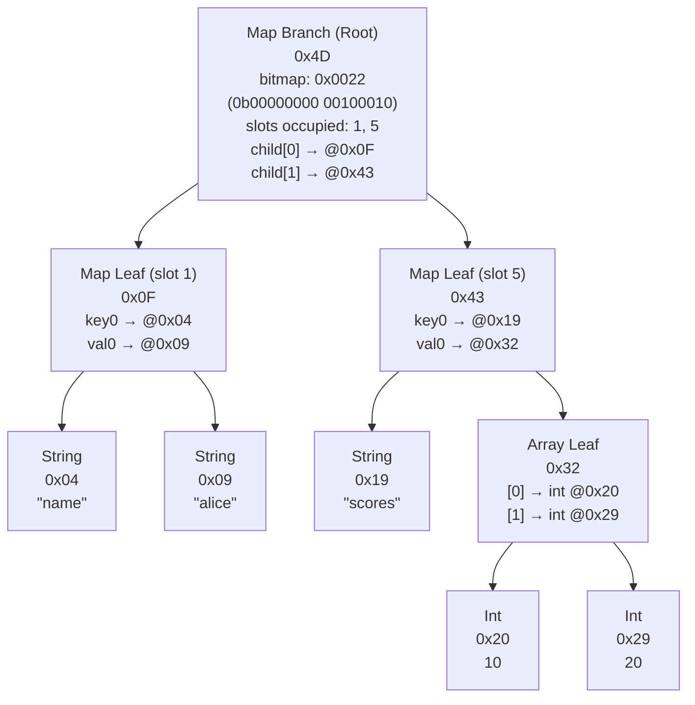
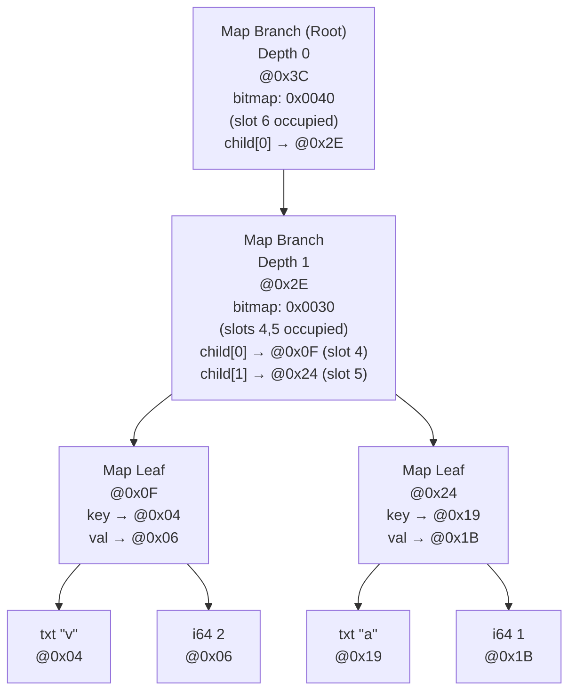
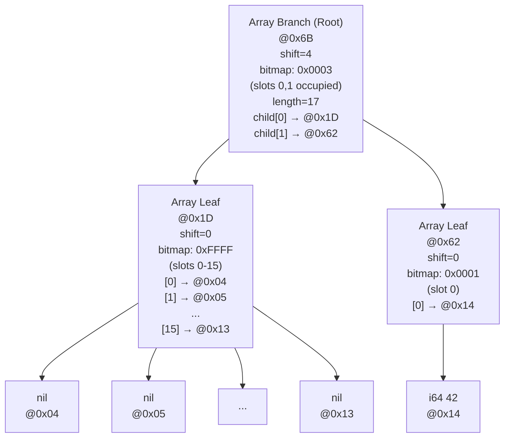

# TRON Memory Layout

## Recap

**TRON** (TRie Object Notation) is a binary format designed to be
JSON-compatible while using:

- **HAMT (Hash Array Mapped Trie)** for maps/objects with fast copy-on-write
  updates
- **Vector Trie** for arrays with efficient structural sharing
- **Append-only writes** with historical root tracking

Key properties:

- Canonical encoding (same logical value = same bytes)
- Random access without full document decoding
- Stream-friendly (read nodes on-demand)
- Self-contained blob suitable for transport or database storage

---

## Document

The full memory byte array is called a document that begins with a 4-byte
header containing the magic bytes `TRON` (0x54524F4E), followed by value nodes,
and always ends with an 8-byte "root footer". The "root footer" contains two
addresses (pointers to value nodes). The document is a linked list of value
nodes. The nodes may be primitive scalar values, or array/map values.

### Header layout (first 4 bytes)

| Offset | Size | Field        |
| ------ | ---- | ------------ |
| 0      | 4    | Magic `TRON` |

### Root footer layout (last 8 bytes)

The footer contains addresses required to be able to find the current root
value node and walk its history:

| Offset | Size | Field                                |
| ------ | ---- | ------------------------------------ |
| 0      | 4    | Root value address (u32 LE)          |
| 4      | 4    | Previous root value address (u32 LE) |

The root footer enables:

- **Copy-on-write updates**: append new value, append new root footer w/ new root value address
- **History tracking**: previous root value addresses form a linked list

---

## Scalar Documents

### Format (canonical - no history)

```
byte0    byte1    byte2    byte3  byte4 ...            byteN-7  byteN-6  byteN-5  byteN-4   byteN-3  byteN-2  byteN-1  byteN
0x54     0x52     0x4f     0x4e                        0x04     0x00     0x00     0x00      0x00     0x00     0x00     0x00
 'T'      'R'      'O'      'N'
└───────────────┬──────────────┘  └───────┬───────┘    └─────────────────┬────────────────┘ └───────────────┬──────────────┘
          magic header            root value record              root value address               prev. root value address
                                                       (starts after header, so @0x04)       (0 for canonical form - no history)
```

Minimum size: 13 bytes (4-byte header + 1-byte nil value + 8-byte footer)

**Example:** scalar `nil`

```
54 52 4F 4E 00 04 00 00 00 00 00 00 00
│           │  │           └──────────── prev root value @0x00 (i.e. no history)
│           │  └──────────── root value @0x04
│           └─────────────── nil value record (0b00000000)
└─────────────────────────── "TRON" magic header
```

**Example:** scalar `"hi"`

```
54 52 4F 4E 2C 68 69 04 00 00 00 00 00 00 00
│           │  │  │  │           └──────────── prev root value @0x00 (i.e. no history)
│           │  │  │  └──────────── root value @0x04
│           │  └──┴─────────────────────────────────────── - "hi" UTF-8 bytes
│           └───────────────────────────────────────────── - txt value tag (packed, len=2)
│                                                            → 0x2c = 0b00101100
│                                                                       └─┬┘│└┬┘
│                                                                         │ │ └─ txt
│                                                                         │ └─ packed
│                                                                         └─ len=2
└─────────────────────────────────────────────────────────── "TRON" magic header
```

---

## Map/Arr Documents

### Format

```
byte0    byte1    byte2    byte3  byte4 ...            byteN-7  byteN-6  byteN-5  byteN-4   byteN-3  byteN-2  byteN-1  byteN
0x54     0x52     0x4f     0x4e                        0x04     0x00     0x00     0x00      0x00     0x00     0x00     0x00
 'T'      'R'      'O'      'N'
└───────────────┬──────────────┘  └───────┬───────┘    └─────────────────┬────────────────┘ └───────────────┬──────────────┘
          magic header            node data section              root value address               prev. root value address
```

Minimum size: 14 bytes (4-byte header + empty map leaf: 2-byte node + 8-byte footer).
Array nodes require additional fields (shift, bitmap, length), so minimum array
document is 21 bytes.

---

## Nodes (a.k.a. Value Records)

All nodes start with a 1-byte tag header:

```
Bit layout: 7 6 5 4 3 2 1 0
            x x x x x T T T
            └───┬───┘ └─┬─┘
       Type-specific   Type
                       (0-7)
```

### Value Types

| Type | Bits       | Description                             | Payload                                                                                                                                     |
| ---- | ---------- | --------------------------------------- | ------------------------------------------------------------------------------------------------------------------------------------------- |
| nil  | `00000000` | JSON null                               | No bytes (tag header tells us all we need)                                                                                                  |
| bit  | `0000B001` | Boolean (true/false)                    | No bytes (true/false value packed in bit 3 of tag header)                                                                                   |
| i64  | `00000010` | Signed 64-bit int                       | 8 bytes, little-endian                                                                                                                      |
| f64  | `00000011` | IEEE-754 64-bit float (a.k.a. "double") | 8 bytes, little-endian                                                                                                                      |
| txt  | `LLLLP100` | UTF-8 string                            | N (1-8) bytes for L (if P=0 because L>15) + L UTF-8 bytes                                                                                   |
| bin  | `LLLLP101` | Raw bytes                               | N (1-8) bytes for L (if P=0 because L>15) + L raw bytes                                                                                     |
| arr  | `0RMMB110` | Array branch/leaf node                  | M+1 bytes for L, 1 byte for shift, 2 bytes for bitmap, if root: 4 bytes for arr length, 4\*entry_count bytes for entries                    |
| map  | `00MMB111` | Map branch/leaf node                    | M+1 bytes for L, 4 bytes for bitmap (if branch), if branch: 4\*entry_count bytes for entries; elif leaf: 2\*4\*n_kv_pairs bytes for entries |

Where `entry_count = popcount(bitmap)`

### Type Encoding: txt, bin

```
Node tag header byte:
  LLLL P TTT
  │    └──── isPacked flag (bit 4)
  └────── if isPacked: length (L); else: length byte count (N)
```

- **Packed** (`P=1`): High 4 bits hold inline length (0-15)
- **Unpacked** (`P=0`): High 4 bits = N (1-8), followed by N bytes encoding length L (little-endian)

### Type Encoding: arr, map

```
0 0/R MM B 11T
   │  │  │   │
   │  │  │   └─ 0=arr; 1=map
   │  │  └─ 0=branch; 1=leaf
   │  └─ number of bytes after header for L (u32)
   └─ if map: always 0; if arr: 0=root, 1=child
```

### Examples

```
nil:            0x00
false:          0x01
true:           0x09
i64(42):        0x02 2A 00 00 00 00 00 00 00
f64(1.5):       0x03 00 00 00 00 00 00 F8 3F
txt "ab":       0x2C 61 62                     (packed len=2)
txt (long):     0x14 20 <32 bytes...>          (unpacked, 1-byte len=32)
bin 0xDDEEFF:   0x3D DD EE FF                  (packed len=3)
bin (long):     0x25 00 01 <256 bytes...>      (unpacked, 2-byte len=256)
arr (root):     0x0E 09 00 00 00 00 00 00 00   (empty root leaf, 9 bytes)
map:            0x06 06                        (empty leaf, 2 bytes)
```

---

## Map Nodes (HAMT)

Maps use a Hash Array Mapped Trie with xxh32 hashing (see spec for full algorithm).

### Hash Slot Calculation

```
hash = xxh32(key_bytes, seed=0)
slot = (hash >> (depth * 4)) & 0xF
       └─────────┬─────────┘ └─┬─┘
                 │             └─ mask to only bottom byte
                 └─ move depth byte to the bottom
```

Each level consumes 4 bits of the hash. With 32-bit hashes and 4-bit chunks,
depths range from 0 (root) to 7 (max), giving 8 possible levels. When writing,
you only go down to the level of the first non-collision.

### Branch Node Layout

| Offset | Size   | Field                                                                            |
| ------ | ------ | -------------------------------------------------------------------------------- |
| 0      | 1      | Node tag header                                                                  |
| 1      | M+1    | Node length                                                                      |
| M+2    | 4      | Bitmap (u32) - note since there are max 16 slots, the upper 2 bytes are always 0 |
| M+6    | 4 \* n | Addresses of child leaves/branches (u32 LE each), ordered by slot index          |

```
Branch node:
  Header
    byte 0
    00MMB111

  Node length
    byteM+1  ...  byte1
    XXXXXXXX ...  XXXXXXXX
    └─────────┬──────────┘
        1-4 bytes (uint)

  Bitmap
    byteM+5  byteM+4   byteM+3  byteM+2
    00000000 00000000  XXXXXXXX XXXXXXXX
    └───────┬───────┘  └───────┬───────┘
        always 0           16 slots
      (entry_count = popcount of bitmap → number of 1s in bitmap)

  Child addresses
    byteM+9  byteM+8   byteM+7  byteM+6  byteM+13 byteM+12 byteM+11 byteM+10  ...
    XXXXXXXX XXXXXXXX XXXXXXXX XXXXXXXX  XXXXXXXX XXXXXXXX XXXXXXXX XXXXXXXX  ...
    └────────────────┬────────────────┘  └────────────────┬────────────────┘
               child 0 address                       child 1 address          ...
```

Child index: `popcount(bitmap & ((1 << slot) - 1))`

### Leaf Node Layout

| Offset | Size   | Field                                                                                                                                                                             |
| ------ | ------ | --------------------------------------------------------------------------------------------------------------------------------------------------------------------------------- |
| 0      | 1      | Node tag header                                                                                                                                                                   |
| 1      | M+1    | Node length                                                                                                                                                                       |
| M+2    | 8 \* n | Addresses of key/value pairs (u32+u32, each LE), ordered by key UTF-8 bytes (keys are unique within node). Key records are always a txt node. Value records can be any node type. |

```
Leaf node:
  Header
    byte 0
    00MMB111

  Node length
    byteM+1  ...  byte1
    XXXXXXXX ...  XXXXXXXX
    └─────────┬──────────┘
        1-4 bytes (uint)

  Entries
    byteM+5  byteM+4   byteM+3  byteM+2  byteM+9  byteM+8   byteM+7  byteM+6  byteM+13
    XXXXXXXX XXXXXXXX XXXXXXXX XXXXXXXX  XXXXXXXX XXXXXXXX XXXXXXXX XXXXXXXX  XXXXXXXX       ...
    └────────────────┬────────────────┘  └────────────────┬────────────────┘  └──┬──────────────
            child 0 key address                 child 0 value address       child 1 key addr ...
         (of a txt value record)               (of an any value record)
    → number of entries (will always be 1 unless max-depth w/ full hash collision)
```

- Entries sorted by UTF-8 key bytes
- Keys are unique within a leaf
- Lookups must compare full key bytes (hash match alone is insufficient)

### Hash Collisions

When two keys hash to the same slot at a given depth, the leaf is split into a
branch and keys are placed in children based on the next hash nibble. This
continues until keys diverge or max depth (7) is reached. Keys with identical
32-bit hashes are stored together in a single leaf at max depth.

### Example: Map Branch

```
Address 0x006E
  07             type=map; B=0=branch; M=0 (0x07 = 0b00_00_0_111)
  12             node_len=18 (total node size)
  41 08 00 00    bitmap=0x0841 (slots 0,6,11)
  13 00 00 00    entry[0] address = @0013
  46 00 00 00    entry[1] address = @0046
  60 00 00 00    entry[2] address = @0060
```

### Example: Map Leaf

```
Address 0x0060
  0F             type=map; B=1=leaf; M=0 (0b00_00_1_111)
  0A             node_len=10 (total node size)
  54 00 00 00    entry[0].key address   = @0054
  57 00 00 00    entry[0].value address = @0057
```

---

## Array Nodes (Vector Trie)

Arrays use a Vector Trie indexed by element position.

### Index Slot Calculation

```
slot = (index >> shift) & 0xF
       └──────┬───────┘ └─┬─┘
              │           └─ mask to only bottom byte
              └─ move the relevant byte of the index to the bottom byte
```

The root shift is chosen so `max_index >> shift <= 0xF`. Each depth down from
the root, the shift is decreased by 4.

### Root Arr Branch Node Layout (R=0)

| Offset | Size   | Field                                                  |
| ------ | ------ | ------------------------------------------------------ |
| 0      | 1      | Node tag header                                        |
| 1      | M+1    | Node length                                            |
| M+2    | 1      | Shift (u8)                                             |
| M+3    | 2      | Bitmap (u16 LE)                                        |
| M+5    | 4      | Length (u32 LE) - array length                         |
| M+9    | 4 \* n | Addresses of child nodes (u32 LE each), in slot order. |

### Root Arr Leaf Node Layout (R=0)

| Offset | Size   | Field                                                   |
| ------ | ------ | ------------------------------------------------------- |
| 0      | 1      | Node tag header                                         |
| 1      | M+1    | Node length                                             |
| M+2    | 1      | Shift (u8)                                              |
| M+3    | 2      | Bitmap (u16 LE)                                         |
| M+5    | 4      | Length (u32 LE) - array length                          |
| M+9    | 4 \* n | Addresses of value nodes (u32 LE, each), in slot order. |

### Child Arr Branch/Leaf Node Layout (R=1)

| Offset | Size   | Field                                                   |
| ------ | ------ | ------------------------------------------------------- |
| 0      | 1      | Node tag header                                         |
| 1      | M+1    | Node length                                             |
| M+2    | 1      | Shift (u8)                                              |
| M+3    | 2      | Bitmap (u16 LE)                                         |
| M+5    | 4 \* n | Addresses of child/value nodes (u32 LE), in slot order. |

**Note:** Only root nodes (R=0) include the 4-byte length field. Child nodes
(R=1) omit it entirely.

### Example: Array Root Leaf

```
Address 0x32:
  0E             type=arr; R=0=root; B=1=leaf; M=0 (0b0_0_00_1_110)
  11             node_len=17 (total node size)
  00             shift=0
  03 00          bitmap=0b11 (slots 0,1)
  02 00 00 00    length=2
  20 00 00 00    entry[0] address = @0020
  29 00 00 00    entry[1] address = @0029
```

---

## Full Document Example

This section shows the complete memory layout of a tree document representing:

```json
{
  "name": "alice",
  "scores": [10, 20]
}
```

### Logical Structure



<details>
  <summary>ASCII plaintext diagram</summary>

```
                          ┌──────────────────────────┐
                          │ Map Branch        (Root) │
                          │ 0x4D                     │
                          │ bitmap: 0x0022           │
                          │    (0b00000000 00100010) │
                          │                  │   │   │
                          │ slots occupied:  5   1   │
                          │ child[0] → @0x0F         │
                          │ child[1] → @0x43         │
                          └────────────┬─────────────┘
                  ┌────────────────────┴─────────────────────┐
                  ▼                                          ▼
        ┌───────────────────┐                       ┌───────────────────┐
        │ Map Leaf (slot 1) │                       │ Map Leaf (slot 5) │
        │ 0x0F              │                       │ 0x43              │
        │ key0 → @0x04      │                       │ key0 → @0x19      │
        │ val0 → @0x09      │                       │ val0 → @0x32      │
        └─────────┬─────────┘                       └─────────┬─────────┘
        ┌─────────┴─────────┐                      ┌──────────┴─────────┐
        ▼                   ▼                      ▼                    ▼
    ┌────────┐          ┌────────┐             ┌──────────┐    ┌─────────────────┐
    │ String │          │ String │             │ String   │    │ Array Leaf      │
    │ 0x04   │          │ 0x09   │             │ 0x19     │    │ 0x32            │
    │ "name" │          │ "alice"│             │ "scores" │    │ [0] → int @0x20 │
    └────────┘          └────────┘             └──────────┘    │ [1] → int @0x29 │
                                                               └────────┬────────┘
                                                                        │
                                                               ┌────────┴───────┐
                                                               │                │
                                                               ▼                ▼
                                                            ┌──────┐         ┌──────┐
                                                            │ Int  │         │ Int  │
                                                            │ 0x20 │         │ 0x29 │
                                                            │ 10   │         │ 20   │
                                                            └──────┘         └──────┘
```

</details>

### Memory Layout (read bottom to top)

Canonical serialization uses depth-first post-order traversal, visiting slots in
ascending order. Children are written before parents, so the root is always last
(immediately before the footer).

```
Address  Bytes                                   Description
─────────────────────────────────────────────────────────────────────────────────
0x00     54 52 4F 4E                             Header: magic "TRON"

0x04     4C 6E 61 6D 65                          txt "name" (packed, L=4)
                                                   tag=0x4C (0b0100_1_100)

0x09     5C 61 6C 69 63 65                       txt "alice" (packed, L=5)
                                                   tag=0x5C (0b0101_1_100)

0x0F     0F                                      Map leaf for slot 1
         0A                                        node_len=10 (total node size)
         04 00 00 00                               key addr → @0x04 ("name")
         09 00 00 00                               val addr → @0x09 ("alice")

0x19     6C 73 63 6F 72 65 73                    txt "scores" (packed, L=6)
                                                   tag=0x6C (0b0110_1_100)

0x20     02 0A 00 00 00 00 00 00 00              i64(10)
                                                   tag=0x02

0x29     02 14 00 00 00 00 00 00 00              i64(20)
                                                   tag=0x02

0x32     0E                                      Array leaf
         11                                        node_len=17 (total node size)
         00                                        shift=0
         03 00                                     bitmap=0x0003 (slots 0,1)
         02 00 00 00                               length=2
         20 00 00 00                               entry[0] addr → @0x20 (i64 10)
         29 00 00 00                               entry[1] addr → @0x29 (i64 20)

0x43     0F                                      Map leaf for slot 5
         0A                                        node_len=10 (total node size)
         19 00 00 00                               key addr → @0x19 ("scores")
         32 00 00 00                               val addr → @0x32 (array)

0x4D     07                                      Map branch (root)
         0E                                        node_len=14 (total node size)
         22 00 00 00                               bitmap=0x0022 (slots 1,5)
         0F 00 00 00                               child[0] → @0x0F (slot 1 leaf)
         43 00 00 00                               child[1] → @0x43 (slot 5 leaf)

0x5B     4D 00 00 00                             Footer: root_addr=@0x4D
         00 00 00 00                               prev_root=0 (canonical)
─────────────────────────────────────────────────────────────────────────────────
Total: 99 bytes (0x63)
```

Tag byte encoding reference:

- `0x07` = `0b00_00_0_111` → map branch (MM=0 → L=1, B=0, TTT=111)
- `0x0E` = `0b00_00_1_110` → arr leaf (MM=0 → L=1, B=1, TTT=110)
- `0x0F` = `0b00_00_1_111` → map leaf (MM=0 → L=1, B=1, TTT=111)
- `0x4C` = `0b0100_1_100` → txt packed L=4
- `0x5C` = `0b0101_1_100` → txt packed L=5
- `0x6C` = `0b0110_1_100` → txt packed L=6

### Traversal: Looking up `scores[1]`

```
┌──────────┐    read footer      ┌─────────────┐
│  Start   │ ─────────────────▶  │ root = 0x4D │
└──────────┘                     └──────┬──────┘
                                        │
                                        ▼
        ┌────────────────────────────────────────────────────────────┐
        │ 1. Hash "scores": xxh32("scores") = 0x12348765             │
        │    slot = (hash >> 0) & 0xF = 5                            │
        │    bitmap 0x0022 has slot 5                                │
        │      → child index = popcount(bitmap & ((1 << slot) - 1))  │
        │                    = popcount(0x0022 & ((1 << 5) - 1))     │
        │                    = popcount(0x0022 & 0x1f)               │
        │                    = popcount(0x2)                         │
        │                    = popcount(0b10)                        │
        │      ∴ child index = 1                                     │
        │    Follow child[1] → address 0x43                          │
        └────────────────────────────────────────────────────────────┘
                                        │
                                        ▼
        ┌────────────────────────────────────────────────────────────┐
        │ 2. At Map Leaf 0x43: scan entries for key "scores"         │
        │    Compare key @ 0x19 with "scores" → match!               │
        │    Value addr = 0x32 (array leaf)                          │
        └────────────────────────────────────────────────────────────┘
                                        │
                                        ▼
        ┌────────────────────────────────────────────────────────────┐
        │ 3. At Array Leaf 0x32: looking for index 1                 │
        │      → slot = (index >> shift) & 0xF                       │
        │             = (1 >> 0) & 0xF                               │
        │      ∴ slot = 1                                            │
        │    bitmap 0x0003 has slot 1                                │
        │      → value index = popcount(0x0003 & 0x1)                │
        │                    = popcount(0b11 & 0b1)                  │
        │                    = popcount(0b1)                         │
        │      ∴ value index = 1                                     │
        │    Read entry[1] addr → 0x29                               │
        └────────────────────────────────────────────────────────────┘
                                        │
                                        ▼
        ┌────────────────────────────────────────────────────────────┐
        │ 4. Read value node at 0x29                                 │
        │    tag = 0x02 → i64                                        │
        │    payload = 0x14 = 20                                     │
        └────────────────────────────────────────────────────────────┘
                                        │
                                        ▼
                                ┌──────────────┐
                                │  Result: 20  │
                                └──────────────┘
```

### After Updating `scores[0]` to `99`

```diff
  {
    "name": "alice",
-   "scores": [10, 20]
+   "scores": [99, 20]
  }
```

```
Before (99 bytes):
┌────────┬─────────┬─────────┬─────────┬──────────┬───────┬───────┬─────────┬──────────┬───────────┬─────────────┐
│ 0x00   │ 0x04    │ 0x09    │ 0x0F    │ 0x19     │ 0x20  │ 0x29  │ 0x32    │ 0x43     │ 0x4D      │ 0x5B        │
│ Header │ txt     │ txt     │ MapLeaf │ txt      │ i64   │ i64   │ ArrLeaf │ MapLeaf  │ MapBranch │ Root footer │
│ "TRON" │ "name"  │ "alice" │ k0@0x04 │ "scores" │ 10    │ 20    │ 0@0x20  │ k0@0x19  │ @0x0F     │ @0x4D       │
│        │         │         │ v0@0x09 │          │       │       │ 1@0x29  │ v0@0x32  │ @0x43     │             │
└────────┴─────────┴─────────┴─────────┴──────────┴───────┴───────┴─────────┴──────────┴───────────┴─────────────┘
           ▲         ▲         ▲ ││      ▲          ▲       ▲       ▲ ││      ▲ ││       ▲ ││        │
           │         └─────────│─┘│      │          │       └───────│─┘│      │ ││       └───────────┘
           └──────────────────────┘      │          └───────────────│──┘      └────────────┘│
                               │         │                          └───────────┘│          │
                               │         └───────────────────────────────────────┘          │
                               └────────────────────────────────────────────────────────────┘
After (186 bytes):
┌──────┬──────┬──────┬──────┬──────┬──────┬──────┬──────┬──────┬──────┬──────┬──────┬────────┬─────────┬────────┬──────────────┐
│ 0x00 │ 0x04 │ 0x09 │ 0x0F │ 0x19 │ 0x20 │ 0x29 │ 0x32 │ 0x43 │ 0x4D │ 0x5B │ 0x63 │ 0x6C   │ 0x7D    │ 0x87   │ 0x95         │
│ Hdr  │ txt  │ txt  │ ML   │ txt  │ i64  │ i64  │ AL   │ ML   │ MB   │ RF   │ i64  │ AL'    │ ML'     │ MB'    │ RF'          │
│      │      │      │      │      │      │      │      │      │      │      │ 99   │ 0@0x63 │ k0@0x19 │ 0@0x0F │ @0x87        │
│      │      │      │      │      │ X    │      │ X    │ X    │ X    │ X    │      │ 1@0x29 │ v0@0x6C │ 1@0x7D │ @0x4D (prev) │
└──────┴──────┴──────┴──────┴──────┴──────┴──────┴──────┴──────┴──────┴──────┴──────┴────────┴─────────┴────────┴──────────────┘
         ▲      ▲      ▲ ││   ▲             ▲                                  ▲      ▲ ││     ▲││       ▲ ││     │
         │      └──────│─┘│   │             └─────────────────────────────────────────│─┘│     │││       └────────┘
         └────────────────┘   │                                                └──────│──┘     └───────────┘│
                       │      │                                                       └─────────┘│          │
                       │      └──────────────────────────────────────────────────────────────────┘          │
                       └────────────────────────────────────────────────────────────────────────────────────┘
```

Note:

- The `"name"` leaf at @0x0F is **reused** (structural sharing)
- Scalars "name", "alice", "scores", and i64(20) are **reused**
- Old arr/map nodes at @0x32, @0x43, @0x4D are **historical** (reachable via
  `prev` chain for time travel)
- The old root footer RF is findable at `prev_root + 1 + (M+1) + node_len` (see
  History Traversal)

---

## Copy-on-Write Updates

When modifying a tree document:

1. Read current root from footer
2. Traverse to target node
3. Build new node with updated content
4. Rebuild ancestor nodes with new child addresses
5. Append all new nodes to end of data
6. Write new footer with updated root address

Old data remains in the file. Readers of the current version ignore it
(following only the current root pointer), but historical versions remain
accessible via the `prev` chain (see History Traversal).

```
Before:
┌────────┬─────────────────┬─────────┐
│ Header │ Node A → Node B │ Footer  │
└────────┴─────────────────┴─────────┘
                            root=A

After updating B:
┌────────┬─────────────────┬─────────┬────────────┬─────────┐
│ Header │ Node A → Node B │ (old)   │ A' → B'    │ Footer  │
└────────┴─────────────────┴─────────┴────────────┴─────────┘
                                                   root=A'
                                                   prev=A
```

---

## History Traversal

The root node is always immediately followed by its footer. This holds for both
canonical documents (depth-first post-order serialization) and copy-on-write
updates (append-only constraint forces children to be written before parents, so
root is always last before footer).

This means you can traverse the full history chain by finding each footer at
`root_address + 1 + (M+1) + node_len`, where M is extracted from the tag byte
(bits 4-3 for arr/map nodes).

### Algorithm

```
history_walk(document):
  footer = read_footer(document)  // last 8 bytes

  while footer.prev_root_address != 0:
    // Read the previous root node tag and length
    tag = read_byte(footer.prev_root_address)
    M = (tag >> 3) & 0x3  // bits 4-3 encode M for arr/map
    node_len = read_uint(footer.prev_root_address + 1, M + 1)  // little-endian

    // The previous footer immediately follows that root node
    // Total node size = 1 (tag) + (M+1) (length field) + node_len (payload)
    prev_footer_address = footer.prev_root_address + 1 + (M + 1) + node_len
    footer = read_footer_at(prev_footer_address)

    yield footer  // or process historical state
```

### Example: Three Versions Deep

```
┌────────┬─────────┬─────────┬─────────┬─────────┬─────────┬─────────┬─────────┬─────────┬─────────┐
│ Header │ nodes   │ Root-2  │ F-2     │ nodes   │ Root-1  │ F-1     │ nodes   │ Root0   │ F0      │
│ "TRON" │         │ @0x14   │         │         │ @0x44   │         │         │ @0x84   │         │
└────────┴─────────┴─────────┴─────────┴─────────┴─────────┴─────────┴─────────┴─────────┴─────────┘
                             │                   │                                        │
                             │                   │          Current footer (end of file) ─┘
                             │                   │          root=0x84, prev=0x44
                             │                   │
                             │                   └─ Found at 0x44 + 1 + 1 + node_len(Root-1)
                             │                      root=0x44, prev=0x14
                             │
                             └─ Found at 0x14 + 1 + 1 + node_len(Root-2)
                                root=0x14, prev=0 (end of history)
```

### Traversal Walkthrough

```
┌─────────────────────────────────────────────────────────┐
│ 1. Read F0 from end of file                             │
│    root=0x84, prev=0x44                                 │
└─────────────────────────────────────────────────────────┘
                                        │
                                        ▼
┌─────────────────────────────────────────────────────────┐
│ 2. Read tag at 0x44 → 0x07 (map branch, M=0)            │
│    Read node_len at 0x45 (1 byte) → 16                  │
│    F-1 is at 0x44 + 1 + 1 + 16 = 0x56                   │
│    Read F-1: root=0x44, prev=0x14                       │
└─────────────────────────────────────────────────────────┘
                                        │
                                        ▼
┌─────────────────────────────────────────────────────────┐
│ 3. Read tag at 0x14 → 0x07 (map branch, M=0)            │
│    Read node_len at 0x15 (1 byte) → 16                  │
│    F-2 is at 0x14 + 1 + 1 + 16 = 0x26                   │
│    Read F-2: root=0x14, prev=0 (stop - no more history) │
└─────────────────────────────────────────────────────────┘
```

This enables full version history without external indexes - the history chain
is embedded in the document itself.

---

## Map Key Hash Collision Example

This document provides a minimal worked example of a TRON map with a **hash
collision at depth 0** that gets resolved at depth 1. This demonstrates how the
HAMT structure handles keys that land in the same slot at a given tree level.

Let's use the keys `"a"` and `"v"`, which have the following xxh32 hashes:

| Key   | xxh32 Hash   | Slot at Depth 0 | Slot at Depth 1 |
| ----- | ------------ | --------------- | --------------- |
| `"a"` | `0x550d7456` | 6               | 5               |
| `"v"` | `0x4b146e46` | 6               | 4               |

Both keys hash to slot 6 at depth 0 (lower nibble `0x6`), creating a
collision. However, they diverge at depth 1 (`0x5` vs `0x4`).

**JSON Representation:**

```json
{ "a": 1, "v": 2 }
```

**TRON Structure:**

Because both keys collide at depth 0, the root cannot be a leaf—it must be a
branch that delegates to a child node at depth 1. That child is also a branch
(since it contains two slots), which then points to two separate leaf nodes.



<details>
<summary>ASCII diagram</summary>

```
                    ┌─────────────────────────────┐
                    │ Map Branch (Root) - Depth 0 │
                    │ @0x3C                       │
                    │ bitmap: 0x0040              │
                    │     (0b00000000 01000000)   │
                    │ slot 6 occupied ─┘          │
                    │ child[0] → @0x2E            │
                    └──────────────┬──────────────┘
                                   │
                                   ▼
                    ┌─────────────────────────────┐
                    │ Map Branch - Depth 1        │
                    │ @0x2E                       │
                    │ bitmap: 0x0030              │
                    │       (0b00000000 00110000) │
                    │ slots 4,5 occupied ─┴┘      │
                    │ child[0] → @0x0F (slot 4)   │
                    │ child[1] → @0x24 (slot 5)   │
                    └──────────────┬──────────────┘
                  ┌────────────────┴────────────────┐
                  ▼                                 ▼
       ┌────────────────────┐            ┌────────────────────┐
       │ Map Leaf           │            │ Map Leaf           │
       │ @0x0F              │            │ @0x24              │
       │ key → @0x04 ("v")  │            │ key → @0x19 ("a")  │
       │ val → @0x06 (2)    │            │ val → @0x1B (1)    │
       └─────────┬──────────┘            └─────────┬──────────┘
          ┌──────┴──────┐                   ┌──────┴──────┐
          ▼             ▼                   ▼             ▼
     ┌─────────┐   ┌─────────┐         ┌─────────┐   ┌─────────┐
     │ txt "v" │   │ i64 2   │         │ txt "a" │   │ i64 1   │
     │ @0x04   │   │ @0x06   │         │ @0x19   │   │ @0x1B   │
     └─────────┘   └─────────┘         └─────────┘   └─────────┘
```

</details>

### Why This (HAMT) Structure?

Because `"a"` and `"v"` collide at depth 0, their "slot" is the same, which
means their calculated map leaf is the same (without the collision, the
intermediate map branch wouldn't be necessary (the root would point straight to
the leaves) because the nodes would get assigned to different slots so would
branch down to different leaves).

We could just immediately stuff both values in to the leaf (that's how we handle
full collisions), but then we're losing lookup performance: we're left with
having to linear search all the elements stuffed in the leaf, instead of
traversing the tree (each branch traversed of the tree reduces the remaining
dataset size to search, which makes its faster).

This is the fundamental collision resolution mechanism: when keys collide at
one level, we descend to the next level where (hopefully) they diverge.

### Byte-Level Layout

Canonical TRON serialization uses depth-first post-order traversal, visiting
slots in ascending order. Children are written before parents.

Serialization order:

1. `"v"` key and value (slot 4 at depth 1 comes before slot 5)
2. Leaf for `"v"` → 2
3. `"a"` key and value
4. Leaf for `"a"` → 1
5. Branch at depth 1
6. Branch at depth 0 (root)
7. Root footer

```
Address  Bytes                                      Description
───────────────────────────────────────────────────────────────────────────────
// === Header ===

0x00     54 52 4F 4E                                magic "TRON"

// === Slot 4 subtree (key "v") ===

0x04     1C 76                                      txt "v" (packed, L=1)
                                                      tag 0x1C = 0b0001_1_100
                                                                   └─┬┘ │ └┬┘
                                                              len=1 ─┘  │  │
                                                            packed (1) ─┘  │
                                                                txt (100) ─┘

0x06     02 02 00 00 00 00 00 00 00                 i64 2
                                                      tag 0x02, payload LE

0x0F     0F                                         Map leaf
         0A                                           node_len=10
         04 00 00 00                                   key addr → @0x04 ("v")
         06 00 00 00                                   val addr → @0x06 (2)

// === Slot 5 subtree (key "a") ===

0x19     1C 61                                      txt "a" (packed, L=1)

0x1B     02 01 00 00 00 00 00 00 00                 i64 1

0x24     0F                                         Map leaf
         0A                                           node_len=10
         19 00 00 00                                   key addr → @0x19 ("a")
         1B 00 00 00                                   val addr → @0x1B (1)

// === Depth-1 branch (resolves the collision) ===

0x2E     07                                         Map branch
                                                      tag 0x07 = 0b00_00_0_111
                                                               MM=0 → L=1, B=0=branch
         0E                                           node_len=14
         30 00 00 00                                   bitmap=0x0030
                                                        (slots 4,5 set)
         0F 00 00 00                                   child[0] → @0x0F (slot 4, "v")
         24 00 00 00                                   child[1] → @0x24 (slot 5, "a")

// === Root branch (depth 0) ===

0x3C     07                                         Map branch (root)
         0A                                           node_len=10
         40 00 00 00                                   bitmap=0x0040
                                                        (slot 6 set)
         2E 00 00 00                                   child[0] → @0x2E (depth-1 branch)

// === Root footer ===

0x46     3C 00 00 00                                root addr → @0x3C
         00 00 00 00                                prev root = 0 (canonical)
───────────────────────────────────────────────────────────────────────────────
Total: 78 bytes (0x4E)
```

### Lookup Walkthrough: Finding `"a"`

```
┌──────────────────────────────────────────────────────────────────────────────┐
│ 1. Read footer (last 8 bytes)                                                │
│    root = @0x3C                                                              │
└──────────────────────────────────────────────────────────────────────────────┘
                                       │
                                       ▼
┌──────────────────────────────────────────────────────────────────────────────┐
│ 2. At root (@0x3C): Map Branch, depth=0                                      │
│    hash("a") = 0x550d7456                                                    │
│    slot = hash & 0xF = 6                                                     │
│    bitmap = 0x0040 → slot 6 is set ✓                                         │
│    child_index = popcount(0x0040 & ((1<<6)-1))                               │
│                = popcount(0x0040 & 0x3F)                                     │
│                = popcount(0x0000) = 0                                        │
│    Follow child[0] → @0x2E                                                   │
└──────────────────────────────────────────────────────────────────────────────┘
                                       │
                                       ▼
┌──────────────────────────────────────────────────────────────────────────────┐
│ 3. At @0x2E: Map Branch, depth=1                                             │
│    slot = (hash >> 4) & 0xF = 5                                              │
│    bitmap = 0x0030 → slot 5 is set ✓                                         │
│    child_index = popcount(0x0030 & ((1<<5)-1))                               │
│                = popcount(0x0030 & 0x1F)                                     │
│                = popcount(0x0010) = 1                                        │
│    Follow child[1] → @0x24                                                   │
└──────────────────────────────────────────────────────────────────────────────┘
                                       │
                                       ▼
┌──────────────────────────────────────────────────────────────────────────────┐
│ 4. At @0x24: Map Leaf                                                        │
│    Scan entries for key "a"                                                  │
│    entry[0]: key @ 0x19 = "a" → MATCH!                                       │
│    value @ 0x1B                                                              │
└──────────────────────────────────────────────────────────────────────────────┘
                                       │
                                       ▼
┌──────────────────────────────────────────────────────────────────────────────┐
│ 5. Read value at @0x1B                                                       │
│    tag = 0x02 → i64                                                          │
│    payload = 1                                                               │
└──────────────────────────────────────────────────────────────────────────────┘
                                       │
                                       ▼
                              ┌────────────────┐
                              │   Result: 1    │
                              └────────────────┘
```

### Map key collision summary

1. Collision == deeper tree: When keys share a slot, the HAMT creates
   intermediate branch nodes until they diverge.
2. Worst case (full collision): Two keys with identical hashes (all slots match)
   end up in the same leaf at max depth (7) - they get stored together in a
   collision bucket which is then linearly searched by actual key value instead of
   hashed key value.
3. Lookup complexity: O(d + c) where d = depth traversed (max 8) and
   c = collision bucket size at the leaf.
4. Structural sharing: During updates, only the path from root to the
   modified leaf needs rewriting - sibling subtrees are reused.

---

## Multi-Level Array Example (Vector Trie)

This section shows a TRON array with 17 elements, which requires multiple levels
in the Vector Trie structure. Any array with more than 16 elements needs a
root shift > 0, creating a tree with depth > 0.

**JSON Representation:**

```json
[
  null,
  null,
  null,
  null,
  null,
  null,
  null,
  null,
  null,
  null,
  null,
  null,
  null,
  null,
  null,
  null,
  42
]
```

This array has:

- 16 nil values at indices 0-15
- One i64(42) value at index 16

### Why Multiple Levels?

The root shift is chosen so `max_index >> shift <= 0xF`. For 17 elements:

- max_index = 16
- 16 >> 0 = 16 > 15, so shift=0 won't work (too many slots needed)
- 16 >> 4 = 1 ≤ 15, so shift=4 works

With shift=4 at the root:

- Indices 0-15: slot = (index >> 4) & 0xF = 0 (all map to slot 0)
- Index 16: slot = (16 >> 4) & 0xF = 1 (maps to slot 1)

So the root branch has two children at slots 0 and 1, each handling a subset
of indices.

### TRON Structure



<details>
<summary>ASCII diagram</summary>

```
                    ┌──────────────────────────────────┐
                    │ Array Branch (Root)              │
                    │ @0x6B                            │
                    │ shift=4                          │
                    │ bitmap: 0x0003 (slots 0,1)       │
                    │ length=17                        │
                    │ child[0] → @0x1D                 │
                    │ child[1] → @0x62                 │
                    └───────────────┬──────────────────┘
                  ┌─────────────────┴──────────────────┐
                  ▼                                    ▼
     ┌─────────────────────────┐          ┌─────────────────────────┐
     │ Array Leaf              │          │ Array Leaf              │
     │ @0x1D                   │          │ @0x62                   │
     │ shift=0                 │          │ shift=0                 │
     │ bitmap: 0xFFFF          │          │ bitmap: 0x0001          │
     │ (slots 0-15)            │          │ (slot 0)                │
     │ [0] → @0x04 (nil)       │          │ [0] → @0x14 (i64 42)    │
     │ [1] → @0x05 (nil)       │          └────────────┬────────────┘
     │ ...                     │                       │
     │ [15] → @0x13 (nil)      │                       ▼
     └───────────┬─────────────┘               ┌──────────────┐
                 │                             │ i64 42       │
    ┌────────────┼────────────┐                │ @0x14        │
    ▼            ▼            ▼                └──────────────┘
┌───────┐   ┌───────┐    ┌───────┐
│ nil   │   │ nil   │    │ nil   │
│ @0x04 │   │ @0x05 │ .. │ @0x13 │
└───────┘   └───────┘    └───────┘
```

</details>

### Byte-Level Layout

Canonical TRON serialization uses depth-first post-order traversal, visiting
slots in ascending order. Children are written before parents.

Serialization order:

1. Values for indices 0-15 (nil values)
2. Value for index 16 (i64 42)
3. Array leaf for slot 0 (indices 0-15)
4. Array leaf for slot 1 (index 16)
5. Array branch (root)
6. Root footer

```
Address  Bytes                                      Description
───────────────────────────────────────────────────────────────────────────────
// === Header ===

0x00     54 52 4F 4E                                magic "TRON"

// === Values ===

0x04     00                                         nil (index 0)
0x05     00                                         nil (index 1)
0x06     00                                         nil (index 2)
0x07     00                                         nil (index 3)
0x08     00                                         nil (index 4)
0x09     00                                         nil (index 5)
0x0A     00                                         nil (index 6)
0x0B     00                                         nil (index 7)
0x0C     00                                         nil (index 8)
0x0D     00                                         nil (index 9)
0x0E     00                                         nil (index 10)
0x0F     00                                         nil (index 11)
0x10     00                                         nil (index 12)
0x11     00                                         nil (index 13)
0x12     00                                         nil (index 14)
0x13     00                                         nil (index 15)

0x14     02 2A 00 00 00 00 00 00 00                 i64(42) (index 16)
                                                     tag=0x02

// === Array Leaf for slot 0 (indices 0-15) ===

0x1D     4E                                         Array leaf (child)
                                                      tag 0x4E = 0b0_1_00_1_110
                                                             R=1 (child), MM=0, B=1 (leaf)
         45                                           node_len=69 (total node size)
         00                                           shift=0
         FF FF                                        bitmap=0xFFFF (all 16 slots)
         04 00 00 00                                  entry[0] addr → @0x04 (nil)
         05 00 00 00                                  entry[1] addr → @0x05 (nil)
         06 00 00 00                                  entry[2] addr → @0x06 (nil)
         07 00 00 00                                  entry[3] addr → @0x07 (nil)
         08 00 00 00                                  entry[4] addr → @0x08 (nil)
         09 00 00 00                                  entry[5] addr → @0x09 (nil)
         0A 00 00 00                                  entry[6] addr → @0x0A (nil)
         0B 00 00 00                                  entry[7] addr → @0x0B (nil)
         0C 00 00 00                                  entry[8] addr → @0x0C (nil)
         0D 00 00 00                                  entry[9] addr → @0x0D (nil)
         0E 00 00 00                                  entry[10] addr → @0x0E (nil)
         0F 00 00 00                                  entry[11] addr → @0x0F (nil)
         10 00 00 00                                  entry[12] addr → @0x10 (nil)
         11 00 00 00                                  entry[13] addr → @0x11 (nil)
         12 00 00 00                                  entry[14] addr → @0x12 (nil)
         13 00 00 00                                  entry[15] addr → @0x13 (nil)

// === Array Leaf for slot 1 (index 16) ===

0x62     4E                                         Array leaf (child)
                                                      tag 0x4E = 0b0_1_00_1_110
                                                             R=1 (child), MM=0, B=1 (leaf)
         09                                           node_len=9 (total node size)
         00                                           shift=0
         01 00                                        bitmap=0x0001 (slot 0 only)
         14 00 00 00                                  entry[0] addr → @0x14 (i64 42)

// === Root Array Branch ===

0x6B     06                                         Array branch (root)
                                                      tag 0x06 = 0b0_0_00_0_110
                                                             R=0 (root), MM=0, B=0 (branch)
         11                                           node_len=17 (total node size)
         04                                           shift=4
         03 00                                        bitmap=0x0003 (slots 0,1)
         11 00 00 00                                  length=17
         1D 00 00 00                                  child[0] addr → @0x1D (leaf for 0-15)
         62 00 00 00                                  child[1] addr → @0x62 (leaf for 16)

// === Root footer ===

0x7C     6B 00 00 00                                root addr → @0x6B
         00 00 00 00                                prev root = 0 (canonical)
───────────────────────────────────────────────────────────────────────────────
Total: 132 bytes (0x84)
```

Tag byte encoding reference:

- `0x0E` = `0b0_0_00_1_110` → arr root leaf (R=0, MM=0, B=1, TTT=110)
- `0x46` = `0b0_1_00_0_110` → arr child branch (R=1, MM=0, B=0, TTT=110)

**Note:** Child array nodes (R=1) do not have the 4-byte length field. Only the
root array node (R=0) includes it.

### Lookup Walkthrough: Finding Element at Index 12

```
┌──────────────────────────────────────────────────────────────────────────────┐
│ 1. Read footer (last 8 bytes)                                                │
│    root = @0x6B                                                              │
└──────────────────────────────────────────────────────────────────────────────┘
                                       │
                                       ▼
┌──────────────────────────────────────────────────────────────────────────────┐
│ 2. At root (@0x6B): Array Branch, shift=4                                    │
│    slot = (index >> shift) & 0xF                                             │
│         = (12 >> 4) & 0xF                                                    │
│         = 0 & 0xF                                                            │
│    ∴ slot = 0                                                                │
│    bitmap = 0x0003 → slot 0 is set ✓                                         │
│    child_index = popcount(0x0003 & ((1 << 0) - 1))                           │
│                = popcount(0x0003 & 0x0)                                      │
│                = popcount(0x0) = 0                                           │
│    Follow child[0] → @0x1D                                                   │
└──────────────────────────────────────────────────────────────────────────────┘
                                       │
                                       ▼
┌──────────────────────────────────────────────────────────────────────────────┐
│ 3. At @0x1D: Array Leaf, shift=0                                             │
│    slot = (index >> shift) & 0xF                                             │
│         = (12 >> 0) & 0xF                                                    │
│         = 12 & 0xF                                                           │
│    ∴ slot = 12                                                               │
│    bitmap = 0xFFFF → slot 12 is set ✓                                        │
│    value_index = popcount(0xFFFF & ((1 << 12) - 1))                          │
│                = popcount(0xFFFF & 0x0FFF)                                   │
│                = popcount(0x0FFF) = 12                                       │
│    Read entry[12] addr → @0x10                                               │
└──────────────────────────────────────────────────────────────────────────────┘
                                       │
                                       ▼
┌──────────────────────────────────────────────────────────────────────────────┐
│ 4. Read value at @0x10                                                       │
│    tag = 0x00 → nil                                                          │
└──────────────────────────────────────────────────────────────────────────────┘
                                       │
                                       ▼
                              ┌────────────────┐
                              │  Result: null  │
                              └────────────────┘
```

### Lookup Walkthrough: Finding Element at Index 16

```
┌──────────────────────────────────────────────────────────────────────────────┐
│ 1. Read footer → root = @0x6B                                                │
└──────────────────────────────────────────────────────────────────────────────┘
                                       │
                                       ▼
┌──────────────────────────────────────────────────────────────────────────────┐
│ 2. At root (@0x6B): Array Branch, shift=4                                    │
│    slot = (16 >> 4) & 0xF = 1                                                │
│    bitmap = 0x0003 → slot 1 is set ✓                                         │
│    child_index = popcount(0x0003 & ((1 << 1) - 1))                           │
│                = popcount(0x0003 & 0x1)                                      │
│                = popcount(0x1) = 1                                           │
│    Follow child[1] → @0x62                                                   │
└──────────────────────────────────────────────────────────────────────────────┘
                                       │
                                       ▼
┌──────────────────────────────────────────────────────────────────────────────┐
│ 3. At @0x62: Array Leaf, shift=0                                             │
│    slot = (16 >> 0) & 0xF = 0                                                │
│    bitmap = 0x0001 → slot 0 is set ✓                                         │
│    value_index = popcount(0x0001 & 0x0) = 0                                  │
│    Read entry[0] addr → @0x14                                                │
└──────────────────────────────────────────────────────────────────────────────┘
                                       │
                                       ▼
┌──────────────────────────────────────────────────────────────────────────────┐
│ 4. Read value at @0x14                                                       │
│    tag = 0x02 → i64                                                          │
│    payload = 42                                                              │
└──────────────────────────────────────────────────────────────────────────────┘
                                       │
                                       ▼
                              ┌────────────────┐
                              │  Result: 42    │
                              └────────────────┘
```

### Multi-level array summary

1. Shift determines depth: Arrays with >16 elements need shift>0 at root.
   The shift decreases by 4 at each level until reaching shift=0 at leaves.
2. Slot calculation: At each level, `slot = (index >> shift) & 0xF` determines
   which child to follow.
3. Root vs child nodes: Only the root node (R=0) includes the 4-byte length
   field. Child nodes (R=1) omit it entirely.
4. Structural sharing: Like maps, updates only rewrite the path from root
   to the modified leaf—sibling subtrees are reused.

---

## Time Complexity

| Operation     | Map (HAMT) | Array (Vector Trie) |
| ------------- | ---------- | ------------------- |
| Lookup        | O(d + c)   | O(d)                |
| Insert/Update | O(d + c)   | O(d)                |
| Delete        | O(d + c)   | O(d)                |

Where:

- `d` = tree depth (depths 0-7, so max 8 levels for 32-bit hash/index with
  nibble/4-bit chunks)
- `c` = collision count (same hash, different keys)

---

## Quick reference

```
Document
  [Header] [Nodes...] [Footer]
   │                   ├─ root_address (u32)
   │                   └─ prev_root_address (u32)
   └─ "TRON" magic

Node tag byte
  Bits: 7 6 5 4 3 2 1 0
        x x x x x T T T
                  └─┬─┘
                  Type (0-7)

Scalar types
  nil:  00000000           (no payload)
  bit:  0000B001           (B=value, no payload)
  i64:  00000010           (8 bytes payload)
  f64:  00000011           (8 bytes payload)
  txt:  LLLLP100           (P=packed; if P: L=len; else L=N, N bytes for len)
  bin:  LLLLP101           (same as txt)

Container types
  arr:  0RMMB110           (R=0:root/1:child, B=0:branch/1:leaf, M+1 bytes for node_len)
  map:  00MMB111           (B=0:branch/1:leaf, M+1 bytes for node_len)

Container node layout
  [Tag 1B] [Length M+1B] [type-specific...]

  arr: shift(1B) + bitmap(2B) + [length(4B) if root] + entries(4B * n)
  map branch: bitmap(4B) + children(4B * n)
  map leaf: key/val pairs(8B * n)
```
