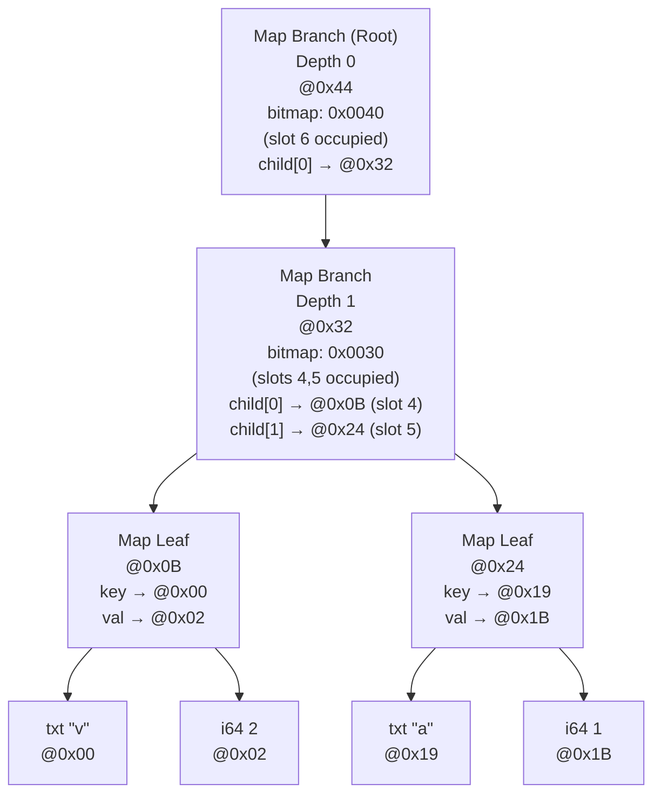

# TRON Memory Layout

## Recap

**TRON** (TRie Object Notation) is a binary format designed to be
JSON-compatible while using:

- **HAMT (Hash Array Mapped Trie)** for maps/objects with fast copy-on-write
  updates
- **Vector Trie** for arrays with efficient structural sharing
- **Append-only writes** with historical root tracking

Key properties:

- Canonical encoding (same logical value = same bytes)
- Random access without full document decoding
- Stream-friendly (read nodes on-demand)
- Self-contained blob suitable for transport or database storage

---

## Document

The full memory byte array is called a document that always ends with a 12-byte
"root footer". The "root footer" contains two addresses (pointers to value
nodes) and a trailing four magic bytes `TRON` (0x54524F4E). The document is a
linked list of value nodes. The nodes may be primitive scalar values, or
array/map values.

### Root footer layout (last 12 bytes)

Documents end in 4 magic bytes and include addresses required to be able
to find the current root value node and walk its history:

| Offset | Size | Field                                |
| ------ | ---- | ------------------------------------ |
| 0      | 4    | Root value address (u32 LE)          |
| 4      | 4    | Previous root value address (u32 LE) |
| 8      | 4    | Magic `TRON`                         |

The root footer enables:

- **Copy-on-write updates**: append new value, append new root footer w/ new root value address
- **History tracking**: previous root value addresses form a linked list

---

## Scalar Documents

### Format (canonical - no history)

```
byte0 ... byteN-4  byteN-11  byteN-10  byteN-9  byteN-8  byteN-7  byteN-6  byteN-5  byteN-4  byteN-3  byteN-2  byteN-1  byteN
                   0x00      0x00      0x00     0x00     0x00     0x00     0x00     0x00     0x54     0x52     0x4f     0x4e
                                                                                              'T'      'R'      'O'      'N'
└───────┬───────┘  └─────────────────┬────────────────┘ └────────────────┬────────────────┘  └───────────────┬──────────────┘
root value record             root value address               prev. root value address                  magic trailer
                   (only 1 node so is at buffer start)   (0 for canonical form - no history)
```

Minimum size: 13 bytes (1-byte nil value + 12-byte trailer)

**Example:** scalar `nil`

```
00 00 00 00 00 00 00 00 00 54 52 4F 4E
│  │           │           └──────────── "TRON" magic
│  │           └──────────── prev root value @0x00 (i.e. no history)
│  └──────────── root value @0x00
└─────────────── nil value record (0b00000000)
```

**Example:** scalar `"hi"`

```
2C 68 69 00 00 00 00 00 00 00 00 54 52 4F 4E
│  │  │  │           │           └──────────── "TRON" magic
│  │  │  │           └──────────── prev root value @0x00 (i.e. no history)
│  │  │  └──────────── root value @0x00
│  └──┴─────────────────────────────────────── - "hi" UTF-8 bytes
└───────────────────────────────────────────── - txt value tag (packed, len=2)
                                                 → 0x2c = 0b00101100
                                                            └─┬┘│└┬┘
                                                              │ │ └─ txt
                                                              │ └─ packed
                                                              └─ len=2
```

---

## Map/Arr Documents

### Format

```
byte0 ... byteN-4  byteN-11  byteN-10  byteN-9  byteN-8  byteN-7  byteN-6  byteN-5  byteN-4  byteN-3  byteN-2  byteN-1  byteN
                                                                                             0x54     0x52     0x4f     0x4e
                                                                                              'T'      'R'      'O'      'N'
└───────┬───────┘  └─────────────────┬────────────────┘ └────────────────┬────────────────┘  └───────────────┬──────────────┘
node data section             root node address                prev. root node address                   magic trailer
```

Minimum size: ?? bytes (empty map leaf: ??-byte node + 12-byte trailer).
Array nodes require additional fields (shift, bitmap, length), so minimum array
document is ?? bytes.

---

## Nodes (a.k.a. Value Records)

All nodes start with a 1-byte tag header:

```
Bit layout: 7 6 5 4 3 2 1 0
            x x x x x T T T
            └───┬───┘ └─┬─┘
       Type-specific   Type
                       (0-7)
```

### Value Types

| Type | Bits       | Description                             | Payload                                                                                                                                                          |
| ---- | ---------- | --------------------------------------- | ---------------------------------------------------------------------------------------------------------------------------------------------------------------- |
| nil  | `00000000` | JSON null                               | No bytes (tag header tells us all we need)                                                                                                                       |
| bit  | `0000B001` | Boolean (true/false)                    | No bytes (true/false value packed in bit 3 of tag header)                                                                                                        |
| i64  | `00000010` | Signed 64-bit int                       | 8 bytes, little-endian                                                                                                                                           |
| f64  | `00000011` | IEEE-754 64-bit float (a.k.a. "double") | 8 bytes, little-endian                                                                                                                                           |
| txt  | `LLLLP100` | UTF-8 string                            | N (1-8) bytes for L (if P=0 because L>15) + L UTF-8 bytes                                                                                                        |
| bin  | `LLLLP101` | Raw bytes                               | N (1-8) bytes for L (if P=0 because L>15) + L raw bytes                                                                                                          |
| arr  | `00MMB110` | Array branch/leaf node                  | M bytes for L, 4 bytes for entry count, 1 byte for shift, 2 bytes for bitmap, 4\*entry_count bytes for entries                                                   |
| map  | `00MMB111` | Map branch/leaf node                    | M bytes for L, 4 bytes for entry count, 4 bytes for bitmap (if branch), 4\*entry_count bytes for entries if branch / 2\*4\*entry_count bytes for entries if leaf |

### Type Encoding: txt, bin

```
Node tag header byte:
  LLLL P TTT
  │    └──── isPacked flag (bit 4)
  └────── if isPacked: length (L); else: length byte count (N)
```

- **Packed** (`P=1`): High 4 bits hold inline length (0-15)
- **Unpacked** (`P=0`): High 4 bits = N (1-8), followed by N bytes encoding length L (little-endian)

### Type Encoding: arr, map

```
00 MM B 11T
   │  │   │
   │  │   └─ 0=arr; 1=map
   │  └─ 0=branch; 1=leaf
   └─ number of bytes after header for L (u32)
```

### Examples

```
nil:            0x00
false:          0x01
true:           0x09
i64(42):        0x02 2A 00 00 00 00 00 00 00
f64(1.5):       0x03 00 00 00 00 00 00 F8 3F
txt "ab":       0x2C 61 62                     (packed len=2)
txt (long):     0x14 20 <32 bytes...>          (unpacked, 1-byte len=32)
bin 0xDDEEFF:   0x3D DD EE FF                  (packed len=3)
bin (long):     0x25 00 01 <256 bytes...>      (unpacked, 2-byte len=256)
arr:            0x?? ??                        arr w/ ??
map:            0x?? ?? ?? ?? ??               map w/ ??
```

---

## Map Nodes (HAMT)

Maps use a Hash Array Mapped Trie with xxh32 hashing (see spec for full algorithm).

### Hash Slot Calculation

```
hash = xxh32(key_bytes, seed=0)
slot = (hash >> (depth * 4)) & 0xF
       └─────────┬─────────┘ └─┬─┘
                 │             └─ mask to only bottom byte
                 └─ move depth byte to the bottom
```

Each level consumes 4 bits of the hash. With 32-bit hashes and 4-bit chunks,
depths range from 0 (root) to 7 (max), giving 8 possible levels. When writing,
you only go down to the level of the first non-collision.

### Branch Node Layout

| Offset | Size   | Field                                                                            |
| ------ | ------ | -------------------------------------------------------------------------------- |
| 0      | 1      | Node tag header                                                                  |
| 1      | M+1    | Node length                                                                      |
| M+2    | 4      | Entry count (u32) [n] - must equal popcount(bitmap)                              |
| M+6    | 4      | Bitmap (u32) - note since there are max 16 slots, the upper 2 bytes are always 0 |
| M+10   | 4 \* n | Addresses of child leaves/branches (u32 LE each), ordered by slot index          |

```
Branch node:
  Header
    byte 0
    00MMB111

  Node length
    byteM+1  ...  byte1
    XXXXXXXX ...  XXXXXXXX
    └─────────┬──────────┘
        1-4 bytes (uint)

  Entry count
    byteM+5  byteM+4   byteM+3  byteM+2
    XXXXXXXX XXXXXXXX  XXXXXXXX XXXXXXXX
    └────────────────┬─────────────────┘
        number of children in slots
 (equal to number of 1s in bitmap, i.e. 0-32)

  Bitmap
    byteM+9  byteM+8   byteM+7  byteM+6
    00000000 00000000  XXXXXXXX XXXXXXXX
    └───────┬───────┘  └───────┬───────┘
        always 0           16 slots

  Child addresses
    byteM+13 byteM+12 byteM+11 byteM+10  byteM+17 byteM+16 byteM+15 byteM+14  ...
    XXXXXXXX XXXXXXXX XXXXXXXX XXXXXXXX  XXXXXXXX XXXXXXXX XXXXXXXX XXXXXXXX  ...
    └────────────────┬────────────────┘  └────────────────┬────────────────┘
               child 0 address                       child 1 address          ...
```

Where `entry_count = popcount(bitmap)`

Child index: `popcount(bitmap & ((1 << slot) - 1))`

### Leaf Node Layout

| Offset | Size   | Field                                                                                                                                                                             |
| ------ | ------ | --------------------------------------------------------------------------------------------------------------------------------------------------------------------------------- |
| 0      | 1      | Node tag header                                                                                                                                                                   |
| 1      | M+1    | Node length                                                                                                                                                                       |
| M+2    | 4      | Entry count (u32) [n] - number of key/value pairs                                                                                                                                 |
| M+6    | 8 \* n | Addresses of key/value pairs (u32+u32, each LE), ordered by key UTF-8 bytes (keys are unique within node). Key records are always a txt node. Value records can be any node type. |

```
Leaf node:
  Header
    byte 0
    00MMB111

  Node length
    byteM+1  ...  byte1
    XXXXXXXX ...  XXXXXXXX
    └─────────┬──────────┘
        1-4 bytes (uint)

  Entry count
    byteM+5  byteM+4   byteM+3  byteM+2
    XXXXXXXX XXXXXXXX  XXXXXXXX XXXXXXXX
    └────────────────┬─────────────────┘
            number of entries (will always be 1 unless max-depth w/ full hash collision)

  Entries
    byteM+9  byteM+8   byteM+7  byteM+6  byteM+13 byteM+12 byteM+11 byteM+10  byteM+17
    XXXXXXXX XXXXXXXX XXXXXXXX XXXXXXXX  XXXXXXXX XXXXXXXX XXXXXXXX XXXXXXXX  XXXXXXXX       ...
    └────────────────┬────────────────┘  └────────────────┬────────────────┘  └──┬──────────────
            child 0 key address                 child 0 value address       child 1 key addr ...
         (of a txt value record)               (of an any value record)
```

- Entries sorted by UTF-8 key bytes
- Keys are unique within a leaf
- Lookups must compare full key bytes (hash match alone is insufficient)

### Hash Collisions

When two keys hash to the same slot at a given depth, the leaf is split into a
branch and keys are placed in children based on the next hash nibble. This
continues until keys diverge or max depth (7) is reached. Keys with identical
32-bit hashes are stored together in a single leaf at max depth.

### Example: Map Branch

```
Address 0x006A
  07             type=map; B=0=branch; M=0 (0x07 = 0b00_00_0_111)
  16             node_len=22 (total node size)
  03 00 00 00    entry_count=3
  41 08 00 00    bitmap=0x0841 (slots 0,6,11)
  0F 00 00 00    entry[0] address = @000F
  42 00 00 00    entry[1] address = @0042
  5C 00 00 00    entry[2] address = @005C
```

### Example: Map Leaf

```
Address 0x005C
  0F             type=map; B=1=leaf; M=0 (0b00_00_1_111)
  0E             node_len=14 (total node size)
  01 00 00 00    entry_count=1
  50 00 00 00    entry[0].key address   = @0050
  53 00 00 00    entry[0].value address = @0053
```

---

## Array Nodes (Vector Trie)

Arrays use a Vector Trie indexed by element position.

### Index Slot Calculation

```
slot = (index >> shift) & 0xF
       └──────┬───────┘ └─┬─┘
              │           └─ mask to only bottom byte
              └─ move the relevant byte of the index to the bottom byte
```

The root shift is chosen so `max_index >> shift <= 0xF`. Each depth down from
the root, the shift is decreased by 4.

### Branch Node Layout

| Offset | Size   | Field                                                  |
| ------ | ------ | ------------------------------------------------------ |
| 0      | 1      | Node tag header                                        |
| 1      | M+1    | Node length                                            |
| M+2    | 4      | Entry count (u32 LE) [n] - must equal popcount(bitmap) |
| M+6    | 1      | Shift (u8)                                             |
| M+7    | 2      | Bitmap (u16 LE)                                        |
| M+9    | 4      | Length (u32 LE)                                        |
| M+13   | 4 \* n | Addresses of child nodes (u32 LE each), in slot order. |

### Leaf Node Layout

| Offset | Size   | Field                                                   |
| ------ | ------ | ------------------------------------------------------- |
| 0      | 1      | Node tag header                                         |
| 1      | M+1    | Node length                                             |
| M+2    | 4      | Entry count (u32 LE) [n] - must equal popcount(bitmap)  |
| M+6    | 1      | Shift (u8)                                              |
| M+7    | 2      | Bitmap (u16 LE)                                         |
| M+9    | 4      | Length (u32 LE)                                         |
| M+13   | 4 \* n | Addresses of value nodes (u32 LE, each), in slot order. |

**Length field:** Only meaningful in the root node (stores array length, valid
indices are `0..length-1`). Non-root nodes must store 0.

### Example: Array Leaf

```
Address 0x00ED:
  0E             type=arr; B=1=leaf; M=0 (0b00_00_1_110)
  15             node_len=21 (total node size)
  02 00 00 00    entry_count=2
  00             shift=0
  03 00          bitmap=0b11 (slots 0,1)
  02 00 00 00    length=2
  6A 00 00 00    entry[0] address = @006A
  D7 00 00 00    entry[1] address = @00D7
```

---

## Full Document Example

This section shows the complete memory layout of a tree document representing:

```json
{
  "name": "alice",
  "scores": [10, 20]
}
```

### Logical Structure


<details>
  <summary>ASCII plaintext diagram</summary>

```
                          ┌──────────────────────────┐
                          │ Map Branch        (Root) │
                          │ 0x00                     │
                          │ bitmap: 0x0022           │
                          │    (0b00000000 00100010) │
                          │                  │   │   │
                          │ slots occupied:  5   1   │
                          │ entry0 → @0x10           │
                          │ entry1 → @0x20           │
                          └────────────┬─────────────┘
                  ┌────────────────────┴─────────────────────┐
                  ▼                                          ▼
        ┌───────────────────┐                       ┌───────────────────┐
        │ Map Leaf (slot 1) │                       │ Map Leaf (slot 5) │
        │ 0x10              │                       │ 0x20              │
        │ key0 → @0x30      │                       │ key0 → @0x50      │
        │ val0 → @0x40      │                       │ val0 → @0x60      │
        └─────────┬─────────┘                       └─────────┬─────────┘
        ┌─────────┴─────────┐                      ┌──────────┴─────────┐
        ▼                   ▼                      ▼                    ▼
    ┌────────┐          ┌────────┐             ┌──────────┐    ┌─────────────────┐
    │ String │          │ String │             │ String   │    │ Array Leaf      │
    │ 0x30   │          │ 0x40   │             │ 0x50     │    │ 0x60            │
    │ "name" │          │ "alice"│             │ "scores" │    │ [0] → int @0x70 │
    └────────┘          └────────┘             └──────────┘    │ [1] → int @0x80 │
                                                               └────────┬────────┘
                                                                        │
                                                               ┌────────┴───────┐
                                                               │                │
                                                               ▼                ▼
                                                            ┌──────┐         ┌──────┐
                                                            │ Int  │         │ Int  │
                                                            │ 0x70 │         │ 0x80 │
                                                            │ 10   │         │ 20   │
                                                            └──────┘         └──────┘
```

</details>

### Memory Layout (read bottom to top)

Canonical serialization uses depth-first post-order traversal, visiting slots in
ascending order. Children are written before parents, so the root is always last
(immediately before the trailer).

```
Address  Bytes                                   Description
─────────────────────────────────────────────────────────────────────────────────
0x00     4C 6E 61 6D 65                          txt "name" (packed, L=4)
                                                   tag=0x4C (0b0100_1_100)

0x05     5C 61 6C 69 63 65                       txt "alice" (packed, L=5)
                                                   tag=0x5C (0b0101_1_100)

0x0B     0F                                      Map leaf for slot 1
         0E                                        node_len=14 (total node size)
         01 00 00 00                               entry_count=1
         00 00 00 00                               key addr → @0x00 ("name")
         05 00 00 00                               val addr → @0x05 ("alice")

0x19     6C 73 63 6F 72 65 73                    txt "scores" (packed, L=6)
                                                   tag=0x6C (0b0110_1_100)

0x20     02 0A 00 00 00 00 00 00 00              i64(10)
                                                   tag=0x02

0x29     02 14 00 00 00 00 00 00 00              i64(20)
                                                   tag=0x02

0x32     0E                                      Array leaf
         15                                        node_len=21 (total node size)
         02 00 00 00                               entry_count=2
         00                                        shift=0
         03 00                                     bitmap=0x0003 (slots 0,1)
         02 00 00 00                               length=2
         20 00 00 00                               entry[0] addr → @0x20 (i64 10)
         29 00 00 00                               entry[1] addr → @0x29 (i64 20)

0x47     0F                                      Map leaf for slot 5
         0E                                        node_len=14 (total node size)
         01 00 00 00                               entry_count=1
         19 00 00 00                               key addr → @0x19 ("scores")
         32 00 00 00                               val addr → @0x32 (array)

0x55     07                                      Map branch (root)
         12                                        node_len=18 (total node size)
         02 00 00 00                               entry_count=2
         22 00 00 00                               bitmap=0x0022 (slots 1,5)
         0B 00 00 00                               child[0] → @0x0B (slot 1 leaf)
         47 00 00 00                               child[1] → @0x47 (slot 5 leaf)

0x67     55 00 00 00                             Trailer: root_addr=@0x55
         00 00 00 00                               prev_root=0 (canonical)
         54 52 4F 4E                               magic "TRON"
─────────────────────────────────────────────────────────────────────────────────
Total: 115 bytes (0x73)
```

Tag byte encoding reference:

- `0x07` = `0b00_00_0_111` → map branch (MM=0, B=0, TTT=111)
- `0x0E` = `0b00_00_1_110` → arr leaf (MM=0, B=1, TTT=110)
- `0x0F` = `0b00_00_1_111` → map leaf (MM=0, B=1, TTT=111)
- `0x4C` = `0b0100_1_100` → txt packed L=4
- `0x5C` = `0b0101_1_100` → txt packed L=5
- `0x6C` = `0b0110_1_100` → txt packed L=6

### Traversal: Looking up `scores[1]`

```
┌──────────┐    read trailer     ┌─────────────┐
│  Start   │ ─────────────────▶  │ root = 0x55 │
└──────────┘                     └──────┬──────┘
                                        │
                                        ▼
        ┌────────────────────────────────────────────────────────────┐
        │ 1. Hash "scores": xxh32("scores") = 0x12348765             │
        │    slot = (hash >> 0) & 0xF = 5                            │
        │    bitmap 0x0022 has slot 5                                │
        │      → child index = popcount(bitmap & ((1 << slot) - 1))  │
        │                    = popcount(0x0022 & ((1 << 5) - 1))     │
        │                    = popcount(0x0022 & 0x1f)               │
        │                    = popcount(0x2)                         │
        │                    = popcount(0b10)                        │
        │      ∴ child index = 1                                     │
        │    Follow child[1] → address 0x47                          │
        └────────────────────────────────────────────────────────────┘
                                        │
                                        ▼
        ┌────────────────────────────────────────────────────────────┐
        │ 2. At Map Leaf 0x47: scan entries for key "scores"         │
        │    Compare key @ 0x19 with "scores" → match!               │
        │    Value addr = 0x32 (array leaf)                          │
        └────────────────────────────────────────────────────────────┘
                                        │
                                        ▼
        ┌────────────────────────────────────────────────────────────┐
        │ 3. At Array Leaf 0x32: looking for index 1                 │
        │      → slot = (index >> shift) & 0xF                       │
        │             = (1 >> 0) & 0xF                               │
        │      ∴ slot = 1                                            │
        │    bitmap 0x0003 has slot 1                                │
        │      → value index = popcount(0x0003 & 0x1)                │
        │                    = popcount(0b11 & 0b1)                  │
        │                    = popcount(0b1)                         │
        │      ∴ value index = 1                                     │
        │    Read entry[1] addr → 0x29                               │
        └────────────────────────────────────────────────────────────┘
                                        │
                                        ▼
        ┌────────────────────────────────────────────────────────────┐
        │ 4. Read value node at 0x29                                 │
        │    tag = 0x02 → i64                                        │
        │    payload = 0x14 = 20                                     │
        └────────────────────────────────────────────────────────────┘
                                        │
                                        ▼
                                ┌──────────────┐
                                │  Result: 20  │
                                └──────────────┘
```

### After Updating `scores[0]` to `99`

```diff
  {
    "name": "alice",
-   "scores": [10, 20]
+   "scores": [99, 20]
  }
```

```
Before (115 bytes):
┌─────────┬─────────┬─────────┬──────────┬───────┬───────┬─────────┬──────────┬───────────┬─────────────┐
│ 0x00    │ 0x05    │ 0x0B    │ 0x19     │ 0x20  │ 0x29  │ 0x32    │ 0x47     │ 0x55      │ 0x67        │
│ txt     │ txt     │ MapLeaf │ txt      │ i64   │ i64   │ ArrLeaf │ MapLeaf  │ MapBranch │ Root footer │
│ "name"  │ "alice" │ k0@0x00 │ "scores" │ 10    │ 20    │ 0@0x20  │ k0@0x19  │ @0x0B     │ @0x55       │
│         │         │ v0@0x05 │          │       │       │ 1@0x29  │ v0@0x32  │ @0x47     │             │
└─────────┴─────────┴─────────┴──────────┴───────┴───────┴─────────┴──────────┴───────────┴─────────────┘
  ▲         ▲         ▲ ││      ▲          ▲       ▲       ▲ ││      ▲ ││       ▲ ││        │
  │         └─────────│─┘│      │          │       └───────│─┘│      │ ││       └───────────┘
  └──────────────────────┘      │          └───────────────│──┘      └────────────┘│
                      │         │                          └───────────┘│          │
                      │         └───────────────────────────────────────┘          │
                      └────────────────────────────────────────────────────────────┘
After (189 bytes):
┌──────┬──────┬──────┬──────┬──────┬──────┬──────┬──────┬──────┬──────┬──────┬────────┬─────────┬────────┬──────────────┐
│ 0x00 │ 0x05 │ 0x0B │ 0x19 │ 0x20 │ 0x29 │ 0x32 │ 0x47 │ 0x55 │ 0x67 │ 0x73 │ 0x7C   │ 0x91    │ 0x9F   │ 0xB1         │
│ txt  │ txt  │ ML   │ txt  │ i64  │ i64  │ AL   │ ML   │ MB   │ RF   │ i64  │ AL'    │ ML'     │ MB'    │ RF'          │
│      │      │      │      │      │      │      │      │      │      │ 99   │ 0@0x73 │ k0@0x19 │ 0@0x0B │ @0x9F        │
│      │      │      │      │ X    │      │ X    │ X    │ X    │ X    │      │ 1@0x29 │ v0@0x7C │ 1@0x91 │ @0x55 (prev) │
└──────┴──────┴──────┴──────┴──────┴──────┴──────┴──────┴──────┴──────┴──────┴────────┴─────────┴────────┴──────────────┘
  ▲      ▲      ▲ ││   ▲             ▲                                  ▲      ▲ ││     ▲││       ▲ ││     │
  │      └──────│─┘│   │             └─────────────────────────────────────────│─┘│     │││       └────────┘
  └────────────────┘   │                                                └──────│──┘     └───────────┘│
                │      │                                                       └─────────┘│          │
                │      └──────────────────────────────────────────────────────────────────┘          │
                └────────────────────────────────────────────────────────────────────────────────────┘
```

Note:

- The `"name"` leaf at @0x0B is **reused** (structural sharing)
- Scalars "name", "alice", "scores", and i64(20) are **reused**
- Old arr/map nodes at @0x32, @0x47, @0x55 are **historical** (reachable via
  `prev` chain for time travel)
- The old trailer T-1 is findable at `prev_root + 1 + (M+1) + node_len` (see
  History Traversal)

---

## Copy-on-Write Updates

When modifying a tree document:

1. Read current root from trailer
2. Traverse to target node
3. Build new node with updated content
4. Rebuild ancestor nodes with new child addresses
5. Append all new nodes to end of data
6. Write new trailer with updated root address

Old data remains in the file. Readers of the current version ignore it
(following only the current root pointer), but historical versions remain
accessible via the `prev` chain (see History Traversal).

```
Before:
┌─────────────────┬──────────┐
│ Node A → Node B │ Trailer  │
└─────────────────┴──────────┘
                   root=A

After updating B:
┌─────────────────┬──────────┬────────────┬──────────┐
│ Node A → Node B │ (old)    │ A' → B'    │ Trailer  │
└─────────────────┴──────────┴────────────┴──────────┘
                                           root=A'
                                           prev=A
```

---

## History Traversal

The root node is always immediately followed by its trailer. This holds for both
canonical documents (depth-first post-order serialization) and copy-on-write
updates (append-only constraint forces children to be written before parents, so
root is always last before trailer).

This means you can traverse the full history chain by finding each trailer at
`root_address + 1 + (M+1) + node_len`, where M is extracted from the tag byte
(bits 4-3 for arr/map nodes).

### Algorithm

```
history_walk(document):
  trailer = read_trailer(document)  // last 12 bytes

  while trailer.prev_root_address != 0:
    // Read the previous root node tag and length
    tag = read_byte(trailer.prev_root_address)
    M = (tag >> 3) & 0x3  // bits 4-3 encode M for arr/map
    node_len = read_uint(trailer.prev_root_address + 1, M + 1)  // little-endian

    // The previous trailer immediately follows that root node
    // Total node size = 1 (tag) + (M+1) (length field) + node_len (payload)
    prev_trailer_address = trailer.prev_root_address + 1 + (M + 1) + node_len
    trailer = read_trailer_at(prev_trailer_address)

    yield trailer  // or process historical state
```

### Example: Three Versions Deep

```
┌─────────┬─────────┬─────────┬─────────┬─────────┬─────────┬─────────┬─────────┬─────────┐
│ nodes   │ Root-2  │ T-2     │ nodes   │ Root-1  │ T-1     │ nodes   │ Root0   │ T0      │
│         │ @0x10   │         │         │ @0x40   │         │         │ @0x80   │         │
└─────────┴─────────┴─────────┴─────────┴─────────┴─────────┴─────────┴─────────┴─────────┘
                    │                   │                                        │
                    │                   │         Current trailer (end of file) ─┘
                    │                   │         root=0x80, prev=0x40
                    │                   │
                    │                   └─ Found at 0x40 + 1 + 1 + node_len(Root-1)
                    │                      root=0x40, prev=0x10
                    │
                    └─ Found at 0x10 + 1 + 1 + node_len(Root-2)
                       root=0x10, prev=0 (end of history)
```

### Traversal Walkthrough

```
┌─────────────────────────────────────────────────────────┐
│ 1. Read T0 from end of file                             │
│    root=0x80, prev=0x40                                 │
└─────────────────────────────────────────────────────────┘
                                        │
                                        ▼
┌─────────────────────────────────────────────────────────┐
│ 2. Read tag at 0x40 → 0x07 (map branch, M=0)            │
│    Read node_len at 0x41 (1 byte) → 16                  │
│    T-1 is at 0x40 + 1 + 1 + 16 = 0x52                   │
│    Read T-1: root=0x40, prev=0x10                       │
└─────────────────────────────────────────────────────────┘
                                        │
                                        ▼
┌─────────────────────────────────────────────────────────┐
│ 3. Read tag at 0x10 → 0x07 (map branch, M=0)            │
│    Read node_len at 0x11 (1 byte) → 16                  │
│    T-2 is at 0x10 + 1 + 1 + 16 = 0x22                   │
│    Read T-2: root=0x10, prev=0 (stop - no more history) │
└─────────────────────────────────────────────────────────┘
```

This enables full version history without external indexes - the history chain
is embedded in the document itself.

---

## Map Key Hash Collision Example

This document provides a minimal worked example of a TRON map with a **hash
collision at depth 0** that gets resolved at depth 1. This demonstrates how the
HAMT structure handles keys that land in the same slot at a given tree level.

Let's use the keys `"a"` and `"v"`, which have the following xxh32 hashes:

| Key   | xxh32 Hash   | Slot at Depth 0 | Slot at Depth 1 |
| ----- | ------------ | --------------- | --------------- |
| `"a"` | `0x550d7456` | 6               | 5               |
| `"v"` | `0x4b146e46` | 6               | 4               |

Both keys hash to slot 6 at depth 0 (lower nibble `0x6`), creating a
collision. However, they diverge at depth 1 (`0x5` vs `0x4`).

**JSON Representation:**

```json
{ "a": 1, "v": 2 }
```

**TRON Structure:**

Because both keys collide at depth 0, the root cannot be a leaf—it must be a
branch that delegates to a child node at depth 1. That child is also a branch
(since it contains two slots), which then points to two separate leaf nodes.



<details>
<summary>ASCII diagram</summary>

```
                    ┌─────────────────────────────┐
                    │ Map Branch (Root) - Depth 0 │
                    │ @0x44                       │
                    │ bitmap: 0x0040              │
                    │     (0b00000000 01000000)   │
                    │ slot 6 occupied ─┘          │
                    │ child[0] → @0x32            │
                    └──────────────┬──────────────┘
                                   │
                                   ▼
                    ┌─────────────────────────────┐
                    │ Map Branch - Depth 1        │
                    │ @0x32                       │
                    │ bitmap: 0x0030              │
                    │       (0b00000000 00110000) │
                    │ slots 4,5 occupied ─┴┘      │
                    │ child[0] → @0x0B (slot 4)   │
                    │ child[1] → @0x24 (slot 5)   │
                    └──────────────┬──────────────┘
                  ┌────────────────┴────────────────┐
                  ▼                                 ▼
       ┌────────────────────┐            ┌────────────────────┐
       │ Map Leaf           │            │ Map Leaf           │
       │ @0x0B              │            │ @0x24              │
       │ key → @0x00 ("v")  │            │ key → @0x19 ("a")  │
       │ val → @0x02 (2)    │            │ val → @0x1B (1)    │
       └─────────┬──────────┘            └─────────┬──────────┘
          ┌──────┴──────┐                   ┌──────┴──────┐
          ▼             ▼                   ▼             ▼
     ┌─────────┐   ┌─────────┐         ┌─────────┐   ┌─────────┐
     │ txt "v" │   │ i64 2   │         │ txt "a" │   │ i64 1   │
     │ @0x00   │   │ @0x02   │         │ @0x19   │   │ @0x1B   │
     └─────────┘   └─────────┘         └─────────┘   └─────────┘
```

</details>

### Why This (HAMT) Structure?

Because `"a"` and `"v"` collide at depth 0, their "slot" is the same, which
means their calculated map leaf is the same (without the collision, the
intermediate map branch wouldn't be necessary (the root would point straight to
the leaves) because the nodes would get assigned to different slots so would
branch down to different leaves).

We could just immediately stuff both values in to the leaf (that's how we handle
full collisions), but then we're losing lookup performance: we're left with
having to linear search all the elements stuffed in the leaf, instead of
traversing the tree (each branch traversed of the tree reduces the remaining
dataset size to search, which makes its faster).

This is the fundamental collision resolution mechanism: when keys collide at
one level, we descend to the next level where (hopefully) they diverge.

### Byte-Level Layout

Canonical TRON serialization uses depth-first post-order traversal, visiting
slots in ascending order. Children are written before parents.

Serialization order:

1. `"v"` key and value (slot 4 at depth 1 comes before slot 5)
2. Leaf for `"v"` → 2
3. `"a"` key and value
4. Leaf for `"a"` → 1
5. Branch at depth 1
6. Branch at depth 0 (root)
7. Root footer

```
Address  Bytes                                      Description
───────────────────────────────────────────────────────────────────────────────
// === Slot 4 subtree (key "v") ===

0x00     1C 76                                      txt "v" (packed, L=1)
                                                      tag 0x1C = 0b0001_1_100
                                                        └─┬┘ │ └┬┘
                                                          │  │  └─ txt (100)
                                                          │  └─ packed (1)
                                                          └─ len=1

0x02     02 02 00 00 00 00 00 00 00                 i64 2
                                                      tag 0x02, payload LE

0x0B     0F                                         Map leaf
         03                                           node_len=14
         01 00 00 00                                   entry_count=1
         00 00 00 00                                   key addr → @0x00 ("v")
         02 00 00 00                                   val addr → @0x02 (2)

// === Slot 5 subtree (key "a") ===

0x19     1C 61                                      txt "a" (packed, L=1)

0x1B     02 01 00 00 00 00 00 00 00                 i64 1

0x24     0F                                         Map leaf
         0E                                           node_len=14
         01 00 00 00                                   entry_count=1
         19 00 00 00                                   key addr → @0x19 ("a")
         1B 00 00 00                                   val addr → @0x1B (1)

// === Depth-1 branch (resolves the collision) ===

0x32     07                                         Map branch
                                                      tag 0x07 = 0b00_00_0_111
                                                               MM=0, B=0=branch
         12                                           node_len=18
         02 00 00 00                                   entry_count=2
         30 00 00 00                                   bitmap=0x0030
                                                        (slots 4,5 set)
         0B 00 00 00                                   child[0] → @0x0B (slot 4, "v")
         24 00 00 00                                   child[1] → @0x24 (slot 5, "a")

// === Root branch (depth 0) ===

0x44     07                                         Map branch (root)
         0E                                           node_len=14
         01 00 00 00                                   entry_count=1
         40 00 00 00                                   bitmap=0x0040
                                                        (slot 6 set)
         32 00 00 00                                   child[0] → @0x32 (depth-1 branch)

// === Root footer ===

0x52     44 00 00 00                                root addr → @0x44
         00 00 00 00                                prev root = 0 (canonical)
         54 52 4F 4E                                magic "TRON"
───────────────────────────────────────────────────────────────────────────────
Total: 94 bytes (0x5E)
```

### Lookup Walkthrough: Finding `"a"`

```
┌──────────────────────────────────────────────────────────────────────────────┐
│ 1. Read trailer (last 12 bytes)                                              │
│    root = @0x44                                                              │
└──────────────────────────────────────────────────────────────────────────────┘
                                       │
                                       ▼
┌──────────────────────────────────────────────────────────────────────────────┐
│ 2. At root (@0x44): Map Branch, depth=0                                      │
│    hash("a") = 0x550d7456                                                    │
│    slot = hash & 0xF = 6                                                     │
│    bitmap = 0x0040 → slot 6 is set ✓                                         │
│    child_index = popcount(0x0040 & ((1<<6)-1))                               │
│                = popcount(0x0040 & 0x3F)                                     │
│                = popcount(0x0000) = 0                                        │
│    Follow child[0] → @0x32                                                   │
└──────────────────────────────────────────────────────────────────────────────┘
                                       │
                                       ▼
┌──────────────────────────────────────────────────────────────────────────────┐
│ 3. At @0x32: Map Branch, depth=1                                             │
│    slot = (hash >> 4) & 0xF = 5                                              │
│    bitmap = 0x0030 → slot 5 is set ✓                                         │
│    child_index = popcount(0x0030 & ((1<<5)-1))                               │
│                = popcount(0x0030 & 0x1F)                                     │
│                = popcount(0x0010) = 1                                        │
│    Follow child[1] → @0x24                                                   │
└──────────────────────────────────────────────────────────────────────────────┘
                                       │
                                       ▼
┌──────────────────────────────────────────────────────────────────────────────┐
│ 4. At @0x24: Map Leaf                                                        │
│    Scan entries for key "a"                                                  │
│    entry[0]: key @ 0x19 = "a" → MATCH!                                       │
│    value @ 0x1B                                                              │
└──────────────────────────────────────────────────────────────────────────────┘
                                       │
                                       ▼
┌──────────────────────────────────────────────────────────────────────────────┐
│ 5. Read value at @0x1B                                                       │
│    tag = 0x02 → i64                                                          │
│    payload = 1                                                               │
└──────────────────────────────────────────────────────────────────────────────┘
                                       │
                                       ▼
                              ┌────────────────┐
                              │   Result: 1    │
                              └────────────────┘
```

### Map key collision summary

1. Collision == deeper tree: When keys share a slot, the HAMT creates
   intermediate branch nodes until they diverge.
2. Worst case (full collision): Two keys with identical hashes (all slots match)
   end up in the same leaf at max depth (7) - they get stored together in a
   collision bucket which is then linearly searched by actual key value instead of
   hashed key value.
3. Lookup complexity: O(d + c) where d = depth traversed (max 8) and
   c = collision bucket size at the leaf.
4. Structural sharing: During updates, only the path from root to the
   modified leaf needs rewriting - sibling subtrees are reused.

---

## Time Complexity

| Operation     | Map (HAMT) | Array (Vector Trie) |
| ------------- | ---------- | ------------------- |
| Lookup        | O(d + c)   | O(d)                |
| Insert/Update | O(d + c)   | O(d)                |
| Delete        | O(d + c)   | O(d)                |

Where:

- `d` = tree depth (depths 0-7, so max 8 levels for 32-bit hash/index with
  nibble/4-bit chunks)
- `c` = collision count (same hash, different keys)

---

## Quick reference

```
Document
  [Nodes...] [Trailer]
              ├─ root_address (u32)
              ├─ prev_root_address (u32)
              └─ "TRON" magic

Node tag byte
  Bits: 7 6 5 4 3 2 1 0
        x x x x x T T T
                  └─┬─┘
                  Type (0-7)

Scalar types
  nil:  00000000           (no payload)
  bit:  0000B001           (B=value, no payload)
  i64:  00000010           (8 bytes payload)
  f64:  00000011           (8 bytes payload)
  txt:  LLLLP100           (P=packed; if P: L=len; else L=N, N bytes for len)
  bin:  LLLLP101           (same as txt)

Container types
  arr:  00MMB110           (B=leaf/branch, M+1 bytes for node_len)
  map:  00MMB111           (B=leaf/branch, M+1 bytes for node_len)

Container node layout
  [Tag 1B] [Length M+1B] [entry_count 4B] [type-specific...]

  arr: shift(1B) + bitmap(2B) + length(4B) + entries(4B * n)
  map branch: bitmap(4B) + children(4B * n)
  map leaf: key/val pairs(8B * n)
```
