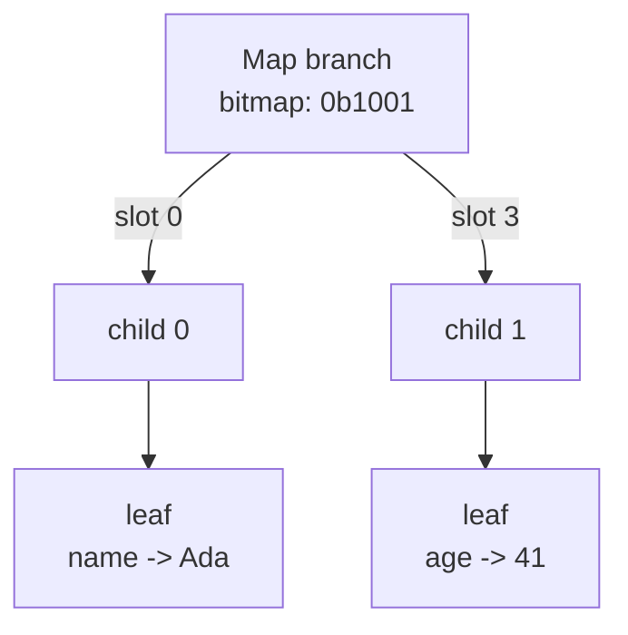
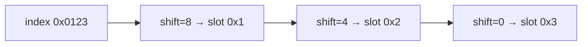
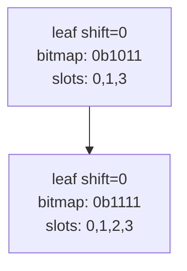
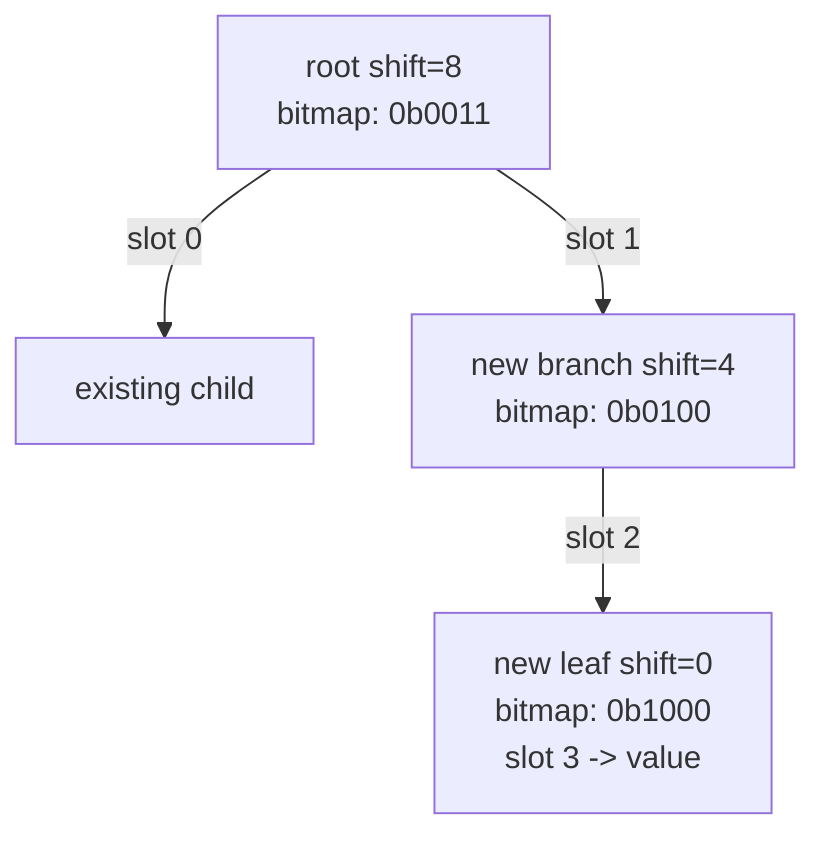
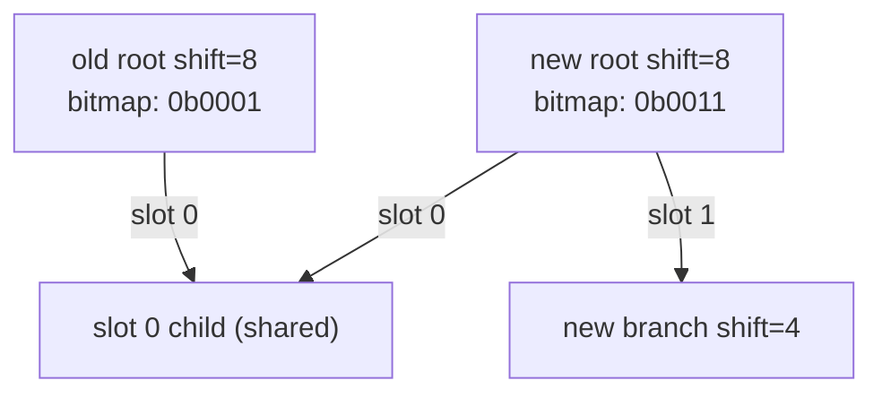
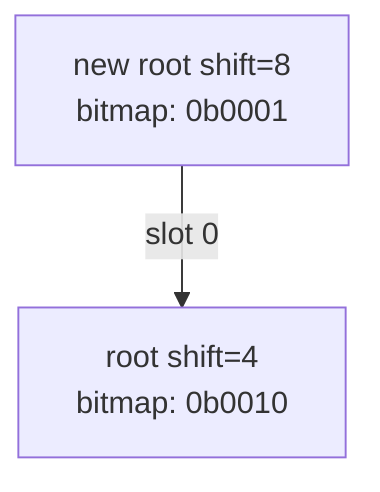

# HAMT and Vector Trie Primer

> [!WARNING]
>
> This document is out-of-date in its current form.
>
> In the meantime, refer to [SPEC.md](./SPEC.md) for ground-truth spec, and
> [MEMORY_LAYOUT.md](./MEMORY_LAYOUT.md) for detailed worked examples.

This primer explains the two core data structures used by TRON: a HAMT for maps and a vector trie for arrays. It focuses on the shape of the trees and how TRON encodes them on the wire.

## HAMT primer (maps)

HAMT = Hash Array Mapped Trie. TRON uses a 16-way HAMT keyed by `xxh32(key_bytes, seed=0)`.

- Each level consumes 4 bits of the hash (a nibble), producing a slot `0..15`.
- Branch nodes store a 16-bit bitmap of which slots are present plus a compact list of child offsets.
- The child index is `popcount(bitmap & ((1<<slot)-1))`.
- Leaf nodes store key/value pairs. At max depth, a leaf may contain multiple entries (hash collisions), kept sorted by UTF-8 key bytes.

Collision handling:

- When two different keys share the same slot at a given depth, the leaf is split into a branch and the keys are pushed down by the next nibble.
- If the full 32-bit hashes are identical, the keys never diverge; they are kept together in the max-depth leaf and matched by full key bytes.

Hash path example:

```
xxh32("name") = 0xCC0BC31F
slots: C -> C -> 0 -> B -> C -> 3 -> 1 -> F
```

HAMT shape (schematic):



## Vector trie primer (arrays)

The vector trie uses the array index directly (no hashing). Each level consumes 4 bits of the index. Branch nodes store a 16-bit bitmap plus child offsets, and leaf nodes (shift=0) store only the present values. The root node carries the array length; non-root nodes keep length=0.

### Index-to-path mapping (exact)

A node’s `shift` says which nibble of the index to use at that level:

```
slot = (index >> shift) & 0xF
```

`shift` is always a multiple of 4 and decreases by 4 each level until it reaches 0 at a leaf.



### Balance and depth

Vector tries are _height-balanced_ in the sense that, for a given root shift, every indexed value lives at the same depth. The depth is fixed by the root shift: `depth = (rootShift / 4) + 1`. Sparse arrays only omit branches; they do not change the depth.

The root shift is chosen to cover the highest index:

```
maxIndex = length - 1
while (maxIndex >> shift) > 0xF:
  shift += 4
```

### Array semantics (slice-like)

TRON arrays follow slice-like semantics:

- **Set** replaces the value at a specific index; index must be in range `0..length-1`.
- **Append** adds one or more values at the end (index = length).
- **Slice** returns a new TRON array containing a copy of `values[start:end]`.

Slice is O(n) because it rebuilds a new trie for the selected range (copy-on-write).

### Derived helpers (not mandated)

These are convenience operations you can build from the core semantics. They match typical Go slice idioms but are not required by the spec.

Prepend:

```
values = materialize(root)
return rebuild([v] + values)
```

Insert at index:

```
values = materialize(root)
return rebuild(values[0:i] + [v] + values[i:])
```

Delete at index:

```
values = materialize(root)
return rebuild(values[0:i] + values[i+1:])
```

All of these are O(n) because they reindex the tail and rebuild a new trie.

### Example: small array (single leaf, set)

With length = 4, the root shift is 0, so the root is a single leaf. Setting index 2 rewrites that one leaf node.



**New nodes created:** 1 (the new leaf). No other nodes are touched.

### Example: setting a missing slot

Assume the root shift is 8 (indexes up to 0xFFFF fit), and we set index `0x0123`.

Step 1: compute slots from the index.


Step 2: if the slot is missing at any branch, TRON builds the remaining path as single-child branches down to a leaf.



Step 3: copy-on-write bubbles the new child offsets up to the root. Only the nodes along the path are re-encoded; siblings are shared.



**New nodes created:** at most one per level on the path, plus the leaf. If the index exceeds the current root shift, each additional wrap adds one new root.

### Example: growing the root

If the index does not fit under the current root shift, TRON wraps the old root in a new root with `shift + 4`.



## How TRON encodes these tries

Both structures share a common node header and then diverge by key type.

- Node header:
  - `u32` packed as `[node_len | key_type | kind]` (kind: branch/leaf, key_type: map/arr).
  - `u32 entry_count` (number of children or values, equals popcount of bitmap).

Map nodes (HAMT):

- Branch: `bitmap:u16`, `reserved:u16`, then `entry_count` child offsets (`u32` each).
- Leaf: repeated `txt key` + `value` records.

Array nodes (vector trie):

- Branch: `shift:u8`, `reserved:u8`, `bitmap:u16`, `length:u32`, then child offsets.
- Leaf: `shift:u8` (must be 0), `reserved:u8`, `bitmap:u16`, `length:u32`, then value records.

Copy-on-write updates:

- Writers append new/updated nodes and values.
- Only the nodes along the modified path are re-encoded.
- The root trailer points at the newest root; older nodes remain for history.

See [`SPEC.md`](SPEC.md) for full byte layouts and canonicalization rules.
