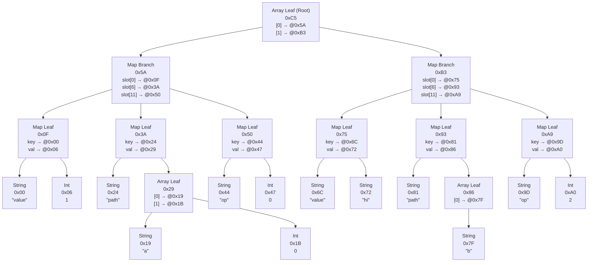

# TRie Object Notation (TRON) Spec (draft)

| Revision | Date       | Author                    | Info                                                |
| -------- | ---------- | ------------------------- | --------------------------------------------------- |
| 0        | 2025-12-30 | @delaneyj                 | Initial design                                      |
| 1        | 2026-01-04 | @delaneyj                 | Add JSON mapping                                    |
| 2        | 2026-01-04 | @delaneyj, @oliverlambson | Fix xxh32 spec                                      |
| 3        | 2026-01-05 | @delaneyj                 | Add JSON Merge Patch and JMESPath                   |
| 4        | 2026-01-08 | @oliverlambson            | Annotate byte-level TRON example                    |
| 5        | 2026-01-08 | @oliverlambson            | Reserve full u32 for HAMT bitmap                    |
| 6        | 2026-01-08 | @oliverlambson            | Revise value tag header format                      |
| 7        | 2026-01-09 | @oliverlambson            | Remove unnecessary reserved bytes                   |
| 8        | 2026-01-10 | @oliverlambson            | Be explicit that all addresses are absolute         |
| 9        | 2026-01-11 | @oliverlambson            | Use a single document type for scalar & tree values |
| 10       | 2026-01-12 | @oliverlambson            | Remove entry_count from arr/map nodes               |

This document defines the binary format for TRie Object Notation. It is intended to be compatible with JSON primitives while using HAMT (for maps) and vector tries (for arrays) to support fast in-place modifications without rewriting the entire document. The format targets transport and embedding as a single blob in databases or KV stores, not a database or storage engine itself.

## 1. Document layout

A TRie Object Notation (TRON) document is a self-contained blob and can be stored in a file, a database cell, or sent over the wire. It is a tree of nodes (value payloads) followed by a root footer.

All multi-byte values are little-endian.

## 2. Byte addressing

TRON document trees are traversed by following "address" values for bytes. An address is the absolute position of a byte within the docuement's byte buffer. Addresses are u32 values starting at 0x00 for the first byte of the buffer.

## 3. Root footer

The root footer lives at the end of a tree document (last 12 bytes). Writers append new nodes, then append a new root footer with the new root address. The previous root address allows walking the history backward. The magic `TRON` is the last 4 bytes of the document.

Root footer layout (from start of footer):

```
Offset  Size  Field
0       4     Root node address (u32)
4       4     Prev root address (u32)
8       4     Magic "TRON"
```

Read flow:

- Read the last 12 bytes and parse the footer (magic is at the end).
- Read the root node at the address; the node's header encodes its length.

Write flow (copy-on-write):

- Append new/updated nodes and values.
- Set prev root address to the prior root address.
- Update the root address in the footer.
- Write the footer last at the end of the document (so readers always see a complete root).

## 4. Node tag header

Each node begins with a 1-byte tag header. The top 3 bits encode the type, the lower 5 bits are type-specific.

| Field         | Bits            |
| ------------- | --------------- |
| Bit positions | 7 6 5 4 3 2 1 0 |
| Meaning       | x x x x x T T T |

- `TTT`: type (0-7)
- `x`: type-specific bits

**Packing rules:**

`nil`, `i64` and `f64` do not use any packing, the high 5 bits must be 0.

`bit` packs the boolean value into bit 3, the high 4 bits must be 0.

`txt` and `bin` use all 5 high bits: bit 3 is the isPacked flag. If isPacked=1, the high 4 bits hold the inline length 0..15. If isPacked=0, the high 4 bits (N) are the number of bytes that follow to encode the payload length; N must be 1..8. Read N bytes (little-endian) to get L. L is the byte length of the payload that follows.

`arr` and `map` use bits 3-4 to encode M, and bit 3 is the branch/leaf flag (B). The M+1 bytes following the tag store node_len, the total size of the node in bytes (including tag and length field). The high 2 bits must be 0.

Type layouts and examples:

### nil (0b000)

Tag bits: `00000000` (0x00). No payload. Represents JSON null.

Example: `0x00`

### bit (0b001)

Tag bits: `0000b001` where `b` is the value bit (0=false, 1=true). Other low bits must be 0. Represents JSON boolean.

Examples:

- false: `0x01`
- true: `0x09`

### i64 (0b010)

Tag bits: `00000010` (0x02). Payload is fixed 8-byte two's complement, little-endian. Used for JSON numbers that fit in i64.

Example: 1234 -> tag `0x02`, payload `0xD2 0x04 0x00 0x00 0x00 0x00 0x00 0x00`

### f64 (0b011)

Tag bits: `00000011` (0x03). Payload is fixed 8-byte IEEE-754 binary64, little-endian. Used for JSON numbers that do not fit in i64.

Example: 1.5 -> tag `0x03`, payload `0x00 0x00 0x00 0x00 0x00 0x00 0xF8 0x3F`

### txt (0b100)

Tag bits: `llllP100` where `P` is isPacked and `llll` is inline length or N. Payload is always a UTF-8 encoded string of length L.

Example: "hi" (inline length 2) -> tag `0x2C`, payload `0x68 0x69`

### bin (0b101)

Tag bits: `llllP101` where `P` is isPacked and `llll` is inline length or N. Payload is raw bytes of length L.

Example: 3 bytes `0xAA 0xBB 0xCC` -> tag `0x3D`, payload `0xAA 0xBB 0xCC`

### arr (0b110)

Tag bits: `00MMB110` where `B` is branch/leaf flag (0=branch, 1=leaf). Payload is: length encoded in `MM + 1` bytes; shift (u8); bitmap (u16); if branch: u32 LE addresses of leaf nodes (`entry_count` \* 4 bytes); if leaf: u32 LE addresses of value nodes (`entry_count` \* 4 bytes). Where `entry_count = popcount(bitmap)`.

Example: leaf arr with one value node at address `0x10` -> tag `0x0E`, payload `0x0D 0x01 0x10 0x00 0x00 0x10 0x00 0x00 0x00`

### map (0b111)

Tag bits: `00MMB111` where `B` is branch/leaf flag (0=branch, 1=leaf). Payload is: length encoded in `MM + 1` bytes; if branch: bitmap (u32) and u32 LE addresses of child nodes (entry_count \* 4 bytes); if leaf: u32 LE addresses of key/value pairs (2 \* n_kv_pairs \* 4 bytes). Where `entry_count = popcount(bitmap)`.

Example: leaf map with key node at address `0x20` and value node at address `0x30` -> tag `0x0F`, payload `0x0E 0x01 0x00 0x00 0x00 0x20 0x00 0x00 0x00 0x30 0x00 0x00 0x00`

## 5. HAMT (map) and vector trie (arr) nodes

Maps use a 16-way HAMT keyed by `xxh32` of the UTF-8 key bytes (seed=0). Arrays use a 16-way vector trie keyed by index bits. Nodes are variable-size and referenced by the node address stored in `arr` and `map` parent node records.

### Map nodes (HAMT)

Map branch node layout:

```
Offset  Size  Field
0       1     Node tag header
1       M+1   Node length
M+2     4     Bitmap (u32) - note since there are max 16 slots, the upper 2 bytes are always 0
M+6     4*n   Addresses of child leaves/branches (n * u32), ordered by slot index
```

Map leaf node layout:

```
Offset  Size  Field
0       1     Node tag header
1       M+1   Node length
M+2     8*n   Addresses of key/value pairs (n * u32+u32), ordered by key UTF-8 bytes (keys are unique within node). Key records are always a txt node. Value records can be any node type.
```

Hash collisions:

- When a leaf contains a single key and a new key lands in the same slot at this depth, the leaf is split into a branch and the two keys are placed in children based on the next hash nibble.
- This splitting continues until the keys diverge or max depth is reached.
- If two different keys have identical 32-bit hashes (full path collision), they cannot diverge; they are stored together in a single leaf at max depth.
- Lookups always compare full UTF-8 key bytes within the leaf to confirm equality (hash match alone is not sufficient).
- Map lookup/update/remove are O(d + c), where d is depth (<= 8 for 32-bit hashes with 4-bit chunks) and c is the number of colliding keys in the leaf bucket.

Hashing:

- hash = `xxh32(key_bytes, seed=0)` interpreted as an unsigned u32
- slot = `(hash >> (depth * 4)) & 0xF`, where root depth is 0.

xxh32 (full algorithm):

```
PRIME1 = 0x9E3779B1
PRIME2 = 0x85EBCA77
PRIME3 = 0xC2B2AE3D
PRIME4 = 0x27D4EB2F
PRIME5 = 0x165667B1

rotl(x, r) = (x << r) | (x >> (32 - r))

round(acc, input):
  acc = acc + (input * PRIME2)
  acc = rotl(acc, 13)
  acc = acc * PRIME1
  return acc

xxh32(data, seed):
  p = 0
  len = data.length

  if len >= 16:
    v1 = seed + PRIME1 + PRIME2
    v2 = seed + PRIME2
    v3 = seed + 0
    v4 = seed - PRIME1
    while p <= len - 16:
      v1 = round(v1, read_u32_le(data, p)); p += 4
      v2 = round(v2, read_u32_le(data, p)); p += 4
      v3 = round(v3, read_u32_le(data, p)); p += 4
      v4 = round(v4, read_u32_le(data, p)); p += 4
    h32 = rotl(v1, 1) + rotl(v2, 7) + rotl(v3, 12) + rotl(v4, 18)
  else:
    h32 = seed + PRIME5

  h32 = h32 + len

  while p <= len - 4:
    h32 = h32 + (read_u32_le(data, p) * PRIME3); p += 4
    h32 = rotl(h32, 17) * PRIME4

  while p < len:
    h32 = h32 + (data[p] * PRIME5); p += 1
    h32 = rotl(h32, 11) * PRIME1

  h32 = h32 ^ (h32 >> 15)
  h32 = h32 * PRIME2
  h32 = h32 ^ (h32 >> 13)
  h32 = h32 * PRIME3
  h32 = h32 ^ (h32 >> 16)
  return h32
```

All arithmetic is modulo 2^32. `read_u32_le` reads 4 bytes little-endian.

Reference implementation: xxh32 MUST match Cyan4973/xxHash (release branch). Canonical test vectors are available in `shared/testdata/vectors/xxhash_sanity_test_vectors.json`, derived from `tests/sanity_test_vectors.h` in that repo.

### Array nodes (vector trie)

Array branch node layout:

```
Offset  Size  Field
0       1     Node tag header
1       M+1   Node length
M+2     1     Shift (u8)
M+3     2     Bitmap (u16)
M+5     4     Length (u32)
M+9     4*n   Addresses of child nodes (n * u32), in slot order.
```

Array leaf node layout:

```
Offset  Size  Field
0       1     Node tag header
1       M+1   Node length
M+2     1     Shift (u8)
M+3     2     Bitmap (u16)
M+5     4     Length (u32)
M+9     4*n   Addresses of value nodes (n * u32), in slot order.
```

Indexing:

- slot = `(index >> shift) & 0xF`
- shift is measured in bits and must be a multiple of 4.
- index is a u32.

Conditions:

- Root node shift is chosen so the highest set bits of the maximum index are covered; for small arrays, shift may be 0.
- Child nodes use `shift - 4`. Leaf nodes must have shift=0.
- Array length is stored in the root node (shift may be 0). Valid indices are `0..length-1`.
- Append is defined as setting index = length; writers update length in the new root.
- Length is defined as max index + 1. When deleting the last element, length must shrink to the next highest existing index + 1.
- Length is meaningful only in the root node; non-root nodes must store 0.
- Array lookup/set/append are O(d), where d is depth (<= 8 for u32 indices with 4-bit chunks).
- Arrays may be sparse during updates; missing indices are treated as `nil` for logical operations. Canonical encoding must densify arrays by rewriting into a new document (filling missing indices with `nil`).

## 6. Update algorithms (pseudocode)

The following pseudocode describes logical updates. Implementations must use copy-on-write as described in section 8.

### Map (HAMT)

Helper functions:

```
slot(hash, depth) = (hash >> (depth * 4)) & 0xF
child_index(bitmap, slot) = popcount(bitmap & ((1 << slot) - 1))
max_depth = 7  // 32 bits / 4 bits per level
```

Lookup:

```
map_get(node, key, depth):
  if node.kind == LEAF:
    return linear_search(node.entries, key)
  s = slot(hash(key), depth)
  if ((node.bitmap >> s) & 1) == 0: return NOT_FOUND
  i = child_index(node.bitmap, s)
  return map_get(node.children[i], key, depth + 1)
```

Set/update:

```
map_set(node, key, value, depth):
  if node.kind == LEAF:
    if key exists: replace value and return node
    if depth == max_depth: insert key/value in order and return node
    // split leaf into branch when hashes diverge
    return leaf_to_branch(node, key, value, depth)
  s = slot(hash(key), depth)
  if bit not set:
    add new child leaf with key/value
  else:
    child = map_set(node.children[i], key, value, depth + 1)
    replace child in children
  update bitmap/entry_count and return new node
```

Delete:

```
map_del(node, key, depth):
  if node.kind == LEAF:
    remove key if present; return node (or EMPTY if no entries)
  s = slot(hash(key), depth)
  if bit not set: return node
  child = map_del(node.children[i], key, depth + 1)
  if child is EMPTY: remove slot bit and child
  update bitmap/entry_count and return node (or EMPTY if no children)
```

Collision handling:

- If multiple keys share the same hash path at max_depth, keep them in a single leaf sorted by UTF-8 key bytes.

Structural merge (maps):

TRON supports right-biased structural merge for maps. The result contains the union of keys; when the same key exists in both inputs, the right value wins. Unchanged subtrees are reused, so best-case merge time is proportional to the number of modified keys.

```
merge(nodeA, nodeB, depth):
  if nodeB.kind == LEAF:
    // small overlay, update A in place
    for each (k,v) in nodeB.entries:
      nodeA = map_set(nodeA, k, v, depth)
    return nodeA

  if nodeA.kind == LEAF:
    // right subtree is larger; clone B and only add missing keys from A
    node = clone(nodeB)
    for each (k,v) in nodeA.entries:
      if map_get(node, k, depth) == NOT_FOUND:
        node = map_set(node, k, v, depth)
    return node

  // both branches
  for slot in 0..15:
    if only A has slot: reuse A child
    if only B has slot: clone B child
    if both have slot: child = merge(A.child, B.child, depth + 1)
  if all children reused from A: return A
  return new branch node
```

Complexity:

- Best case O(changes) when inputs share most structure.
- Worst case O(n) when inputs are disjoint or have little shared structure.
- Hashing is only required for keys in leaf overlays and during `map_set`; branch-only traversal does not recompute hashes.

### Array (vector trie)

Helper functions:

```
slot(index, shift) = (index >> shift) & 0xF
child_index(bitmap, slot) = popcount(bitmap & ((1 << slot) - 1))
```

Lookup:

```
arr_get(node, index):
  if node.shift == 0:
    s = slot(index, 0)
    if bit not set: return NOT_FOUND
    i = child_index(node.bitmap, s)
    return node.values[i]
  s = slot(index, node.shift)
  if bit not set: return NOT_FOUND
  i = child_index(node.bitmap, s)
  return arr_get(node.children[i], index)
```

Insert/update:

```
arr_set(node, index, value):
  if index >= root.length: return OUT_OF_RANGE
  if node.shift == 0:
    set value at slot s (create if missing)
    update bitmap/entry_count and return node
  s = slot(index, node.shift)
  if bit not set:
    create child (shift - 4) and set value
  else:
    child = arr_set(node.children[i], index, value)
  update bitmap/entry_count and return node
  // root length is unchanged
```

Append:

```
arr_append(root, values...):
  for v in values:
    root = arr_set(root, index = root.length, value = v)
    root.length++
  return root
```

Slice (copy):

```
arr_slice(root, start, end):
  if start > end or end > root.length: return OUT_OF_RANGE
  // materialize dense values[0..length)
  // return rebuild_array(values[start:end])
```

Root growth:

- If index requires a higher shift than the current root, create a new root with increased shift and insert the old root as a child.

## 7. Canonical encoding

Canonical encoding is defined as a full vacuum/re-encode of a logical JSON value into a new TRON document. The result must be byte-for-byte deterministic.

Rules:

- Use the shortest valid tag encoding for every value:
  - If inline packing is possible (txt/bin), use it.
  - Otherwise, use the minimal byte length L and minimal length-of-length N.
  - For `i64` and `f64`, payloads are fixed 8 bytes.
- For maps, build a 16-way HAMT from the full key set using xxh32 (seed=0). Nodes are constructed deterministically by slot order at each depth. Leaf nodes contain collision buckets only at max depth.
- For arrays, build a 16-way vector trie with the minimal root shift that covers the maximum index (length-1). Leaf nodes must have shift=0. Indices are 0..length-1; missing indices are not allowed (use `nil` explicitly).
- Serialize nodes in depth-first post-order, visiting slots in ascending order. Children are written before parents.
- The root node is the last node written; root address points to that node. The trailer is written last.
- For canonical output, the root trailer prev root address must be zero.

## 8. Copy-on-write updates

TRON is append-only at the byte level. Writers must not modify existing bytes in place.

Update flow:

- Read the current root from the trailer and traverse to the target leaf.
- Build a new leaf node with the updated entry.
- Rebuild ancestor nodes up to a new root, updating child addresses to point at newly appended nodes.
- Append all newly built nodes and any new value payloads.
- Append a new root footer with the updated root/prev root addresses; the trailer must be the final 12 bytes.
- Old nodes and old root footers remain: they are ignored by readers unless traversing the history.

Update behavior:

- Array set/append/slice are structural updates: rewrite the affected leaf and its ancestor path (or rebuild for slice).
- Map set/delete are structural updates: rewrite the affected leaf and its ancestor path.
- Branch nodes update their bitmaps and entry counts; empty branches are removed.

## 9. Patch format (JSON Patch semantics)

TRON Patch applies JSON Patch semantics (RFC 6902) with a binary-friendly encoding. A patch is a TRON `arr` of operation records. Each operation record is a TRON `map` with fields:

- `op`: byte enum (i64 in range 0..5, fixed 8-byte payload)
- `path`: `arr` of path tokens
- `value`: optional, any TRON value (required for add/replace/test)
- `from`: optional, `arr` of path tokens (required for move/copy)

Op byte enum:

```
0  add
1  remove
2  replace
3  move
4  copy
5  test
```

Path tokens:

- Map key: `txt`
- Array index: `i64` (must be in range 0..u32 max)
- Append: `txt` with value `-` (JSON Patch append semantics)

Operations are applied in order and follow RFC 6902 error handling (e.g., test failures, invalid paths).

Example (JSON Patch equivalent):

- JSON Patch:
  - add /a/0 = 1
  - replace /b = "hi"

- TRON Patch (conceptual):
  - op=add (0), path=[txt "a", i64 0], value=i64 1
  - op=replace (2), path=[txt "b"], value=txt "hi"

Batching guidance:

- Implementations MAY batch operations to reduce copy-on-write churn.
- Batching must preserve RFC 6902 semantics: results are identical to applying ops in order.
- Safe batching groups ops that touch the same subtree and do not have ordering dependencies (e.g., multiple updates under the same map branch or array leaf).

### Merge Patch (RFC 7386 semantics)

TRON also supports JSON Merge Patch semantics for maps. A merge patch is represented as a regular TRON value (scalar or tree) and applied to a target document.

Rules:

- If the patch is not a map (scalar or array), the result is the patch value (replace).
- If the patch is a map, the target is treated as an object; non-map targets are treated as empty maps.
- For each key in the patch map:
  - If the patch value is `nil`, remove the key from the result.
  - If the patch value is a map and the target value is a map, recursively merge.
  - Otherwise, replace the target value with the patch value.
- Arrays are treated as scalars and are always replaced, never merged.

Complexity:

- O(k \* d) for k updated keys and depth d in the map trie, with structural reuse of unchanged subtrees.

## 10. Byte-level example (canonical TRON document)

Encode this JSON patch instruction in TRON:

- JSON Patch:
  - add /a/0 = 1
  - replace /b = "hi"

**JSON representation:**

```json
[
  {
    "value": 1,
    "path": ["a", 0],
    "op": 0
  },
  {
    "value": "hi",
    "path": ["b"],
    "op": 2
  }
]
```

_Note that in the representation of the json patch above, the paths have been
split and the ops have been enumerated._

**TRON logical structure:**



**TRON bytes (hex, addresses at left):**

```
// Object 0: {"value": 1, "path": ["a", 0], "op": 0}
// node: key "value"
0000: 5C 76 61 6C 75 65                 "value"::txt (packed, len=5)
// node: value 1
0006: 02 01 00 00 00 00 00 00 00        1::i64
// node: map leaf {"value": 1}
000F: 0F                                type=map; B=1=leaf; M=0 (0b00_00_1_111)
0010: 0A                                node_len=10
0011: 00 00 00 00                       entry[0].key address   = @0000
0015: 06 00 00 00                       entry[0].value address = @0006
// node: "a" (path element)
0019: 1C 61                             "a"::txt (packed, len=1)
// node: 0 (path element)
001B: 02 00 00 00 00 00 00 00 00        0::i64
// node: key "path"
0024: 4C 70 61 74 68                    "path"::txt (packed, len=4)
// node: array ["a", 0]
0029: 0E                                type=arr; B=1=leaf; M=0 (0b00_00_1_110)
002A: 11                                node_len=17
002B: 00                                shift=0
002C: 03 00                             bitmap=0b11 (slots 0,1)
002E: 02 00 00 00                       length=2
0032: 19 00 00 00                       entry[0] address = @0019
0036: 1B 00 00 00                       entry[1] address = @001B
// node: map leaf {"path": [...]}
003A: 0F                                type=map; B=1=leaf; M=0 (0b00_00_1_111)
003B: 0A                                node_len=10
003C: 24 00 00 00                       entry[0].key address   = @0024
0040: 29 00 00 00                       entry[0].value address = @0029
// node: key "op"
0044: 2C 6F 70                          "op"::txt (packed, len=2)
// node: value 0
0047: 02 00 00 00 00 00 00 00 00        0::i64
// node: map leaf {"op": 0}
0050: 0F                                type=map; B=1=leaf; M=0 (0b00_00_1_111)
0051: 0A                                node_len=10
0052: 44 00 00 00                       entry[0].key address   = @0044
0056: 47 00 00 00                       entry[0].value address = @0047
// node: map branch (object 0)
005A: 07                                type=map; B=0=branch; M=0 (0b00_00_0_111)
005B: 12                                node_len=18
005C: 41 08 00 00                       bitmap=0x0841 (slots 0,6,11)
0060: 0F 00 00 00                       slot[0] address  = @000F (leaf "value")
0064: 3A 00 00 00                       slot[6] address  = @003A (leaf "path")
0068: 50 00 00 00                       slot[11] address = @0050 (leaf "op")

// Object 1: {"value": "hi", "path": ["b"], "op": 2}
// node: key "value"
006C: 5C 76 61 6C 75 65                 "value"::txt (packed, len=5)
// node: value "hi"
0072: 2C 68 69                          "hi"::txt (packed, len=2)
// node: map leaf {"value": "hi"}
0075: 0F                                type=map; B=1=leaf; M=0 (0b00_00_1_111)
0076: 0A                                node_len=10
0077: 6C 00 00 00                       entry[0].key address   = @006C
007B: 72 00 00 00                       entry[0].value address = @0072
// node: "b" (path element)
007F: 1C 62                             "b"::txt (packed, len=1)
// node: key "path"
0081: 4C 70 61 74 68                    "path"::txt (packed, len=4)
// node: array ["b"]
0086: 0E                                type=arr; B=1=leaf; M=0 (0b00_00_1_110)
0087: 0D                                node_len=13
0088: 00                                shift=0
0089: 01 00                             bitmap=0b1 (slot 0)
008B: 01 00 00 00                       length=1
008F: 7F 00 00 00                       entry[0] address = @007F
// node: map leaf {"path": [...]}
0093: 0F                                type=map; B=1=leaf; M=0 (0b00_00_1_111)
0094: 0A                                node_len=10
0095: 81 00 00 00                       entry[0].key address   = @0081
0099: 86 00 00 00                       entry[0].value address = @0086
// node: key "op"
009D: 2C 6F 70                          "op"::txt (packed, len=2)
// node: value 2
00A0: 02 02 00 00 00 00 00 00 00        2::i64
// node: map leaf {"op": 2}
00A9: 0F                                type=map; B=1=leaf; M=0 (0b00_00_1_111)
00AA: 0A                                node_len=10
00AB: BD 00 00 00                       entry[0].key address   = @009D
00AF: C0 00 00 00                       entry[0].value address = @00A0
// node: map branch (object 1)
00B3: 07                                type=map; B=0=branch; M=0 (0b00_00_0_111)
00B4: 12                                node_len=18
00B5: 41 08 00 00                       bitmap=0x0841 (slots 0,6,11)
00B9: 75 00 00 00                       slot[0] address  = @0075 (leaf "value")
00BD: 93 00 00 00                       slot[6] address  = @0093 (leaf "path")
00C1: A9 00 00 00                       slot[11] address = @00A9 (leaf "op")

// Root array
00C5: 0E                                type=arr; B=1=leaf; M=0 (0b00_00_1_110)
00C6: 11                                node_len=17
00C7: 00                                shift=0
00C8: 03 00                             bitmap=0b11 (slots 0,1)
00CA: 02 00 00 00                       length=2
00CE: 5A 00 00 00                       entry[0] address = @005A (object 0)
00D2: B3 00 00 00                       entry[1] address = @00B3 (object 1)

// Root footer
00D6: C5 00 00 00                       root address = @00C5
00DA: 00 00 00 00                       prev root address = 0 (canonical)
00DE: 54 52 4F 4E                       magic "TRON"
```

Bytes = 226

## 11. JSON mapping

This section defines a deterministic mapping between TRON values and JSON
for interop and fixtures. It matches the reference implementation.

JSON -> TRON:

- `null` => `nil`
- `true`/`false` => `bit`
- numbers:
  - if the input is an integer within signed 64-bit range, encode as `i64`
  - otherwise encode as `f64`
- strings:
  - if the string starts with `b64:` and the remainder is valid base64,
    decode to `bin`
  - otherwise encode as `txt` (UTF-8 bytes of the JSON string)
- arrays => `arr` trie using indices 0..n-1
- objects => `map` trie using UTF-8 key bytes (duplicate key handling
  follows the JSON parser; typically the last value wins)

TRON -> JSON:

- `nil` => `null`
- `bit` => `true`/`false`
- `i64` => JSON number (decimal)
- `f64` => JSON number (must be finite; otherwise error)
- `txt` => JSON string
- `bin` => JSON string with prefix `b64:` followed by base64 payload
- `arr`/`map` => JSON array/object

Notes:

- The `b64:` prefix is reserved for binary encoding in JSON. If a string
  begins with `b64:` but is not valid base64, it remains a `txt` string.

## 12. Optional addendum: implementation features

The following features are not required for core TRON format compatibility.
They are documented here because some implementations (for example, the Go
implementation) provide them.

- TRON Patch: apply RFC 7386 JSON Merge Patch semantics to TRON documents and
  return an updated TRON document without a full decode/encode cycle.
- JMESPath queries: evaluate JMESPath-style expressions directly against TRON
  documents and return TRON values.
